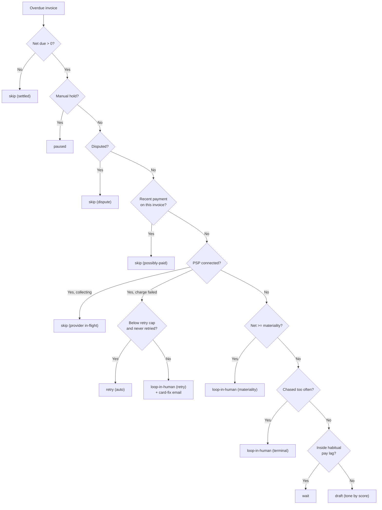

## Overview

A dunning campaign is a timer. Day 3, day 7, day 14, the same ladder for every overdue customer. That works until it meets a real accounts receivable book, where three things go wrong on the same day:

- The customer who has paid on day 8 for two years gets a past due notice on day 3.
- An invoice that a partial payment already covered gets chased for its full face value.
- A customer whose card expired gets a "please pay your invoice" email, when what they need is a link to update the card.

The Dunning Agent reads the account before it writes the email. It pulls twelve months of invoices and payments, works out how this customer actually pays, and then acts at the lowest rung that is justified. If nothing is justified, it does nothing and says why.

<Frame caption="Dunning Agent">
  
</Frame>

<Info>
**BETA** ✨

The Dunning Agent is in beta and available upon request. **[Contact us](mailto:hello@getlago.com)** to get access.

Unlike the [Finance Assistant](/guide/ai-agents/finance-assistant), this agent acts. It sends email and re-attempts card charges against your real customers. Run a dry-run sweep first, read the decisions it made, and confirm the policy limits before you let it run unattended.
</Info>

## What it does

- **Investigates before it chases:** twelve months of invoices and payments per customer, not a days-overdue counter.
- **Respects payment patterns:** a customer who reliably pays a few days late and is still inside that window gets no email.
- **Chases the net amount:** payments and credit notes are netted out before anything is decided, so a partial payment is never chased at face value.
- **Treats a declined card as a declined card:** a card-fix email with a self-serve portal link, and a retry, instead of a payment reminder.
- **Hands off what should not be automated:** large balances and repeatedly unanswered accounts stop and go to a person.
- **States a defensible reason:** every decision cites the rule that fired and the evidence for it. No citation means no action.

## Dunning campaigns and the Dunning Agent

| | Dunning campaign | Dunning Agent |
|---|---|---|
| **Selects who to chase** | Overdue balance threshold | Overdue balance, then eleven investigation rungs |
| **Decides the next step** | Fixed attempts and delays | Per-customer, re-evaluated every run |
| **Reads payment history** | No | Yes, 12 months |
| **Partial payments** | Chases the invoice total | Chases the net still owed |
| **Declined card** | Same reminder as everyone | Card-fix email plus a retry |
| **Escalates to a human** | No | Yes, with a reason and a recommended action |
| **Availability** | Premium add-on | Beta, on request |

Campaigns are the deterministic floor: predictable, auditable, no model involved. The agent is the judgment layer for the accounts where a fixed ladder gets it wrong. Running both is a reasonable setup.

## How it decides: the disposition ladder

One ordered ladder, re-evaluated from live billing data on every run. The first rung that matches wins, and the agent stops there.

| # | Rung | Condition | Disposition |
|---|---|---|---|
| 0 | Settled | Net due is zero or less | `skip (settled)` |
| 1 | Manual hold | A person took the account over | `paused` |
| 2 | Disputed | The invoice carries `payment_dispute_lost_at` | `skip (dispute)` |
| 3 | Possibly paid | A settled payment landed on **this** invoice recently | `skip (possibly-paid)` |
| 4 | Provider collecting | A PSP is connected and nothing has failed | `skip (provider in-flight)` |
| 5 | Failed charge, small | Net below the retry cap, never retried | `retry (auto)` |
| 6 | Failed charge, large or exhausted | At or above the cap, or already retried | `loop-in-human (retry)` |
| 7 | Materiality | Net at or above the materiality line | `loop-in-human (materiality)` |
| 8 | Terminal | Chased the maximum number of times, no result | `loop-in-human (terminal)` |
| 9 | Respect the pattern | Reliable habitual lag, still inside it | `wait` |
| 10 | No email | No address on the customer record | `skip (no email)` |
| 11 | Otherwise | Nothing above matched | `draft (tone)` |



<Note>
**Net, never face value.** Lago keeps an invoice at `payment_status: pending` and its full `total_amount_cents` after a partial payment. The amount already paid shows up in `total_paid_amount_cents`, not on the balance.

The agent computes `total_amount_cents - total_paid_amount_cents - credit_notes_amount_cents` and uses that number everywhere: the email, the materiality test, the retry cap, and the Slack alert.
</Note>

The weekly touch cap and the deduplication window are **not** rungs on this ladder. They are gates inside the policy engine, so a customer who is over cadence still reaches rung 11 and the resulting action comes back `HELD` rather than being sent. See [Guardrails](#guardrails).

## Score decides tone, pattern decides whether to chase

These are two separate signals, and confusing them is the mistake a campaign makes.

**Score** is the on-time rate across the last 12 months of paid invoices. It needs at least three invoices on record; below that the customer defaults to `occasionally-late`. It sets the tone of the email and nothing else.

| Score | Condition | Tone | Subject line |
|---|---|---|---|
| `good-payer` | Late on under 25% of invoices | Gentle | `Quick reminder: N invoice(s), $X` |
| `occasionally-late` | Late on 25% to 50%, or under three invoices on record | Neutral | `Following up: N invoice(s) — $X past due` |
| `repeat-late` | Late on over 50% of invoices | Firm | `Past due notice: N invoice(s) — $X` |

**Pattern** is the median pay lag across those same invoices, plus whether that lag is consistent. It is only considered reliable when there are at least three paid invoices and the lags cluster within a few days of the median. It decides whether to chase at all.

A customer who reliably pays eight days late and is six days overdue gets `wait`, **even when their score is `repeat-late`**. Consistency is not a collections problem. Scattered lags mean there is no pattern to respect, so the agent chases.

Scores are cached per customer and recomputed from live history once the cache goes stale.

## What triggers a run

| Trigger | What it does |
|---|---|
| `sweep --dry-run` | Walks the full ladder and reports every decision. No sends, no retries, no Slack. |
| `sweep` | The real autonomous pass. Sends, retries, posts the alert. |
| Chat: *"who owes me money"* | Runs the same sweep in dry-run and reports it. Read-only. |
| Chat: *"go ahead, chase them"* | Runs it for real. Requires an explicit go-ahead. |
| Scheduled sweep | Hourly background pass. Opt-in and off by default. |
| Approving a queued action | Executes one held action after a human clears it. |

<Info>
**There are no webhook triggers.** The work queue is a single query, `GET /invoices?payment_overdue=true&status=finalized`, so Lago's own `payment_overdue` flag is the selection condition and `status=finalized` guarantees a draft or voided invoice is never chased.

Dunning is day-scale. A sweep that re-derives every decision from live billing data is more robust than an event stream that has to keep per-invoice state in sync.
</Info>

## What it can do

| Action | Blast radius | When it runs automatically |
|---|---|---|
| `send_reminder_email` | Low | Whenever every gate passes |
| `retry_payment` | Low | Only below the retry cap, and only once per invoice |

Two email shapes come out of this:

- **The reminder.** One email per customer per run, consolidating every overdue invoice. Each line carries the invoice number, the net amount, the due date, and the days overdue. Customers with no payment provider get an extra line telling them to disregard it if they have already paid, because a bank transfer may not be recorded in Lago yet.
- **The card-fix email.** Sent when a provider charge failed. It says the card was declined, links to the customer's Lago portal so they can update it, and tells them the charge will be re-attempted automatically.

### What it never does

The agent has no ability to terminate a subscription, suspend service, issue a credit note, issue a refund, apply wallet credit, or contact anyone outside the reminder path. When one of those is the right call, it says so in the Slack alert and stops. A person decides.

## Guardrails

<Warning>
This agent sends real email and re-attempts real charges. Every limit below is enforced in deterministic code, not in a prompt. A model cannot talk its way past them.
</Warning>

The agent proposes; the engine disposes. The reasoning layer builds a proposed action and can never execute anything. A policy engine runs it through a fixed chain of gates and is the only thing that executes.

| Gate | What it checks | Outcome when it trips |
|---|---|---|
| Defensibility | The action cites at least one policy clause and one piece of evidence | Escalates to approval |
| Weekly budget | Touches to this customer in the last 7 days, against the cap | Holds |
| Deduplication | The same action already went out inside the dedup window | Holds |
| Blast radius | Anything rated above `low` | Escalates to approval |
| Freshness | Re-reads the invoice from Lago immediately before sending | Aborts if paid or disputed since the decision |

A held action is not queued anywhere. It is simply retried on the next sweep, once the cadence window clears. An escalated action goes to the approval queue, and approving it re-runs the cadence gates before it fires, because time has passed since the proposal.

Outcomes you will see on each row of a run:

`EXECUTED` · `HELD` · `QUEUED for approval` · `ABORTED` · `SKIPPED`

## Three ways to run it

The same decision policy ships in three packagings. What changes is the runtime, where memory lives, and how a message goes out.

| | Skill | Platform agent | Self-hosted app |
|---|---|---|---|
| **Runs in** | claude.ai or Claude Code | Claude managed agent, scheduled | Your own infrastructure |
| **Reads Lago via** | MCP connector | REST with a vaulted key | REST |
| **Memory** | Lago customer metadata | Lago customer metadata | Postgres |
| **Email** | Gmail draft, never sent | Gmail draft, never sent | SMTP send, gated |
| **Failed card charge** | Drafts a card-fix email, flags a human | Same | Retries below the cap |
| **Approval queue** | None | None | Yes |

Pick by how much you want it to do. The Skill is the zero-infrastructure way to see the decisions and keep a person in the send loop. The platform agent is the same policy on a schedule. The app is the one that actually collects.

<Tabs>
  <Tab title="Skill">
    Upload the skill folder under **Settings → Capabilities → Skills**, then enable the Lago, Gmail, and Slack connectors on your account. Ask *"who owes me money"* and it runs the full ladder.

    It creates Gmail **drafts** and never sends. A person reviews each draft and sends it.

    Because the Skill is otherwise stateless, it remembers past runs in the customer's Lago metadata:

    | Key | Format | Meaning |
    |---|---|---|
    | `dunning_score` | `repeat-late@2026-07-20` | The cached score and when it was computed |
    | `dunning_contact` | `firm@2026-07-18#3` | Last tone, last contact date, times chased |
    | `dunning_hold` | `materiality@2026-07-18` or any truthy value | The account is paused |

    A hold the agent set itself is reconciled against live billing on every run and cleared once its cause is gone. A hold a human set is always honored and never auto-cleared. To resume automation, remove the key or set it to `0`.

    <Warning>
    Metadata writes must **merge**. Read the customer's current `metadata`, resend every existing item **with its id**, and add only the new keys. Resending an existing key without its id makes Lago reject it as a duplicate, and any item you do not resend is deleted.
    </Warning>
  </Tab>
  <Tab title="Self-hosted app">
    A single service: the chat interface, the sweep, and the policy engine over one Postgres.

    ```bash
    cp .env.template .env          # fill LAGO_API_URL, LAGO_API_KEY, and a model key
    python -m app init-db          # create the state tables
    python -m app sweep --dry-run  # decide and report, no side effects
    python -m app sweep            # the real pass
    python -m app web              # chat UI on :8000
    ```

    Or with Docker:

    ```bash
    docker compose up --build      # Postgres + the app on http://localhost:8000
    ```

    Memory lives in Postgres, not in Lago metadata: a session per customer holding the score cache and the pause state, and an append-only decision log that is both the audit trail and the source of truth for the cadence gates.
  </Tab>
</Tabs>

## Tools you can connect

| Tool | What it gets you |
|---|---|
| **Lago** | The billing truth. Overdue invoices, customer history, payments, disputes, portal links. One write: the payment retry. |
| **Any SMTP server** | Sending, in the app profile. Point it at MailHog locally and nothing reaches a real customer while you tune the policy. |
| **Gmail** | Drafts, in the Skill and platform-agent profiles. The agent writes, a person sends. |
| **Slack** | One consolidated alert per run, to an incoming webhook, listing only the accounts a human should look at. |
| **Your payment provider** | Reached **through Lago**. A retry calls Lago's retry endpoint, which re-attempts collection on the customer's connected provider. The agent never talks to Stripe or any PSP directly, so it inherits whatever you have already configured. |
| **Amazon Bedrock or the Anthropic API** | The model backend for the drafting and chat layer. |
| **Postgres** | Durable state: sessions, decision log, approvals. |
| **Redis and Celery** | The scheduled sweep. Opt-in. |

### Extending it

An action is four things: a type, a blast radius, an executor, and a freshness check. A gate is a function appended to the chain. Adding a CRM task, an in-app notification, or a payment-link action does not require touching the ladder, and anything you rate above `low` requires human approval by default.

## Configure the policy

| Setting | Default | What it controls |
|---|---|---|
| `LAGO_API_URL` | none | Your Lago API base URL |
| `LAGO_API_KEY` | none | The API key that scopes the data |
| `MAX_TOUCHES_PER_WEEK` | `2` | Outbound touches per customer per 7 days |
| `DEDUP_WINDOW_HOURS` | `48` | How long the same action is blocked from repeating |
| `SCORE_FRESH_DAYS` | `14` | How long a cached score is trusted before recomputing |
| `RECENTLY_PAID_DAYS` | `14` | The possibly-paid lookback window |
| `MATERIALITY_CENTS` | `1000000` | Net due at or above this goes to a human. Default $10,000 |
| `TERMINAL_TOUCHES` | `3` | Touches with no result before the account is handed off |
| `RETRY_AUTO_CAP_CENTS` | `200000` | Failed charges below this are auto-retried. Default $2,000 |
| `SLACK_WEBHOOK_URL` | none | Where the alert goes. Blank means the alert is logged, not posted |
| `LAGO_APP_URL` | none | Your dashboard base URL, for the deep links in the Slack alert |
| `MODEL_PROVIDER` | `bedrock` | `bedrock` or `anthropic` |

<Note>
The ladder order, the email templates and tones, the score thresholds, the 12-month scoring window, and the buffer on the habitual-lag check are not settings. Changing them is a code change, not a configuration change.
</Note>

## Review and approve

<Steps>
  <Step title="List what is waiting">
    ```bash
    curl localhost:8000/approvals
    ```
    Each entry carries the customer, the action type, the blast radius, the invoices involved, and the gate that escalated it.
  </Step>
  <Step title="Read the reason">
    The full proposed action is persisted, including the email body. Nothing is approved blind.
  </Step>
  <Step title="Approve it">
    ```bash
    curl -XPOST localhost:8000/approvals/<id>/approve
    ```
    The cadence gates re-run and the invoice is re-read from Lago before anything is sent. If it was paid in the meantime, the action aborts.
  </Step>
</Steps>

## The Slack alert

One message per run, not one per account, ordered by urgency. Each line leads with a plain-language reason and a recommended action, and ends with a short note on how automation resumes.

| Reason | What happened | What a human should do |
|---|---|---|
| Materiality | The balance is above the line where automated reminders stop | The account owner reaches out personally |
| Terminal | Chased repeatedly with no response | Call, offer a payment plan, or consider collections |
| Retry | A card charge keeps failing | A card-fix email went out; check the card or retry |
| Dispute | The invoice is under dispute | Resolve the dispute before any collection |
| Possibly paid | A payment recently landed on this invoice | Verify and reconcile before chasing |
| Manual hold | A person took the account over | Nothing. This is a heads-up, not a task |

`wait` and cadence holds are not alerted. They resolve themselves on the next run, and alerting on them would train people to ignore the channel.

## Limitations

- **Every run sweeps every overdue customer.** Waking only the customers that are due is not implemented yet.
- **No webhook triggers.** Selection is a query against `payment_overdue`, not an event subscription.
- **The scheduled sweep is opt-in** and off by default. Until you enable it, runs are manual or driven from chat.
- **Pausing an account in the app profile is a state change**, not a toggle in the Lago UI. In the Skill profile it is the `dunning_hold` metadata key.
- **Emails are plain text.** No HTML templates, no branding.
- **The drafting layer is AI-generated.** The ladder and the gates are deterministic, but the wording of a reminder is not. Read a dry-run before you trust it unattended.

## Related

- [Automatic dunning](/guide/dunning/automatic-dunning): rule-based dunning campaigns.
- [Manual dunning](/guide/dunning/manual-dunning): request payment for an overdue balance on demand.
- [Payment retries](/guide/payments/payment-retries): retry collection on a single invoice.
- [Billing Assistant](/guide/ai-agents/billing-assistant): run billing operations in natural language.
- [Lago MCP Server](/guide/ai-agents/mcp-server): connect Lago data to any AI client.
