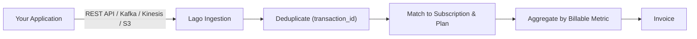
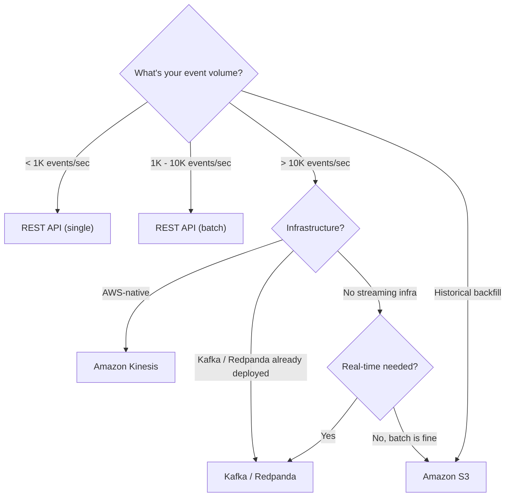

Lago turns usage into invoices. You send events describing what your customers consumed (API calls, compute hours, transactions, tokens), and Lago matches each event to the right subscription and pricing plan, deduplicates it, and aggregates everything into accurate, auditable invoices.

This page is your complete integration guide: how to **design** your events for billing, **send** them through any delivery method, and **handle** edge cases like retries and late arrivals.



## Designing your events

<Frame caption="Event structure">
      
</Frame>

A well-designed event captures what happened, who it happened for, and the dimensions you need for pricing. Getting this right upfront saves you from reworking your integration later.

The guiding question: **what do you charge your customers for?** That's your event.

### Event schema

```json
{
  "transaction_id": "txn_20240314_cust8832_inference_00142",
  "external_subscription_id": "sub_8832",
  "code": "ai_inference",
  "timestamp": 1710421740,
  "properties": {
    "model": "gpt-4",
    "tokens_in": 820,
    "tokens_out": 1500,
    "region": "us-east-1"
  }
}
```

<AccordionGroup>
  <Accordion title="transaction_id (required)">
    A unique ID you generate. Lago uses it for **deduplication**: if the same event arrives twice, only the first is billed.

    <Tip>
      **Good practice:** Don't use random UUIDs. Embed the customer, event type, and timestamp so you can trace a billed amount back to its source event without guessing:
      ```
      {type}_{date}_{customer}_{category}_{sequence}

      # Examples
      inf_20240314_cust42_gpt4_00831
      compute_20240314_org7_a100_useast_001
      pay_20240314_acct3391_card_00092
      ```
    </Tip>

    <Warning>
      If your Lago organization uses the ClickHouse-based event pipeline (designed for high-volume processing), event uniqueness is maintained with **both** `transaction_id` and `timestamp` fields:
      - If both are new to Lago, the event is ingested
      - If both have already been received, the new event **replaces** the previous one
    </Warning>
  </Accordion>

  <Accordion title="external_subscription_id (required)">
    Ties the event to a customer subscription. This is how Lago knows which pricing plan to apply. The `external_subscription_id` must match an active subscription in Lago.
  </Accordion>

  <Accordion title="code (required)">
    Maps to a [billable metric](/guide/billable-metrics/create-billable-metrics) you've defined in Lago (e.g., `ai_inference`, `api_calls`, `storage_gb`). Treat the `code` as a stable API contract between your application and your billing configuration.
  </Accordion>

  <Accordion title="timestamp (required)">
    When the event happened, as a **Unix timestamp**. Lago uses this to assign the event to the correct billing period.

    We typically log events using **timestamps in seconds**, such as `1741219251`. When higher precision is required, you can use **millisecond accuracy** in the format `1741219251.590`, where the dot acts as the decimal separator.

    <Info>
      If you do not specify a timestamp, Lago automatically uses the reception date of the event.
    </Info>
  </Accordion>

  <Accordion title="properties (optional)">
    Key-value pairs carrying the data your pricing needs: token counts, regions, instance types, anything you price on. Properties can be `strings`, `integers`, `floats`, `uuids`, or `timestamps`.

    Lago ignores properties that don't match a billable metric, so **include dimensions you might price on in the future** — extra fields cost nothing but give you pricing flexibility later.

    <Info>
      For `UNIQUE COUNT` aggregation on a `recurring` metric, the `operation_type` property is required. Send `add` to add a value or `remove` to remove one.
    </Info>
  </Accordion>

  <Accordion title="precise_total_amount_cents (optional)">
    Skip Lago's aggregation and set the dollar amount directly. This value must be a **string** to avoid floating-point rounding issues.

    If not specified, Lago sets it to 0 and the event is not included in charge aggregation for dynamic charge models.
  </Accordion>
</AccordionGroup>

---

## Use cases in detail

<Tabs>
  <Tab title="AI / LLM">
    **Billing model:** Per-token pricing, rates vary by model and sometimes by input vs. output tokens.

    **Event design:** One event per inference request. Properties carry `model`, `tokens_in`, `tokens_out`, and any other dimensions you price on.

    ```json
    {
      "transaction_id": "inf_20240314150900_cust42_gpt4_00831",
      "external_subscription_id": "sub_42",
      "code": "llm_tokens",
      "timestamp": 1710421740,
      "properties": {
        "model": "gpt-4",
        "tokens_in": 820,
        "tokens_out": 1500,
        "latency_ms": 1230,
        "stream": true
      }
    }
    ```

    **Billable metric setup:** Create a metric `llm_tokens` with aggregation type `SUM` and a custom expression like `properties.tokens_in + properties.tokens_out`. Use `model` as a charge filter to apply different per-token rates for GPT-4, GPT-3.5, Claude, etc.

    <Tip>
      Include `latency_ms` and `stream` in properties even if you don't price on them today. Lago ignores unused properties, but having the data means you can add latency-based tiers or streaming surcharges later without re-instrumenting.
    </Tip>

    **Volume consideration:** A busy AI platform might generate thousands of inference events per second. At low volume, send every event via REST API. At high volume, stream through Kafka or pre-aggregate to one event per customer per model per hour.
  </Tab>

  <Tab title="Cloud / GPU">
    **Billing model:** Per compute-hour pricing, rates vary by instance type, region, and on-demand vs. spot.

    **Event design:** One event per compute session (or per billing interval within a long-running session). Properties carry the full instance specification.

    ```json
    {
      "transaction_id": "compute_20240314_org7_a100_useast_0001",
      "external_subscription_id": "sub_org7",
      "code": "compute_hours",
      "timestamp": 1710421740,
      "properties": {
        "instance_type": "gpu-a100-80gb",
        "region": "us-east-1",
        "hours": 1.0,
        "spot": false,
        "gpu_count": 8,
        "vcpus": 96,
        "memory_gb": 1024
      }
    }
    ```

    **Billable metric setup:** Metric `compute_hours` with `SUM` aggregation on the `hours` property. Use charge filters on `instance_type` and `region` to apply dimension-specific rates. With Lago's "most specific match wins" filter algorithm, you can set a default rate and override for specific instance types without creating hundreds of separate metrics.

    <Info>
      A Nasdaq-listed GPU cloud provider runs this exact pattern in production, processing **10M events/month** across **400+ machine instance types**, all billed on a single `compute_hours` metric. They pre-aggregate to one event per customer per instance type per day.
    </Info>

    <Tip>
      **Handling long-running sessions:** For VMs that run for days or weeks, emit a heartbeat event every hour rather than a single event at termination. This way, if a session crashes, you've already captured usage up to the last heartbeat.
    </Tip>
  </Tab>

  <Tab title="Fintech">
    **Billing model:** Per-transaction pricing, potentially with volume tiers, and rates that vary by payment method and geography.

    **Event design:** One event per transaction processed. Properties carry the transaction details your pricing needs.

    ```json
    {
      "transaction_id": "pay_20240314_acct3391_card_00092",
      "external_subscription_id": "sub_3391",
      "code": "transactions",
      "timestamp": 1710421740,
      "properties": {
        "amount_cents": 15000,
        "currency": "USD",
        "payment_method": "card",
        "card_brand": "visa",
        "country": "US",
        "is_3ds": true
      }
    }
    ```

    **Billable metric setup:** For per-transaction flat fees, use `COUNT` aggregation on the `transactions` metric with charge filters on `payment_method` (different rates for card vs. ACH vs. wire). For percentage-based fees, use a custom expression like `properties.amount_cents * 0.029` or set up pricing tiers in your charge configuration.

    <Info>
      A major global payments company runs Lago self-hosted, processing **thousands of transactions per second**. They started on Postgres (validated at 10K events/sec) and later migrated to ClickHouse + Kafka for higher throughput — same event format, same pricing config, zero billing logic changes.
    </Info>

    **Currency handling:** Include `currency` in properties and use charge filters or custom expressions to handle multi-currency pricing. For FX, you can either convert at the event level (include `amount_usd_cents` as a derived property) or let Lago handle it through metric expressions.
  </Tab>

  <Tab title="API Platform">
    **Billing model:** Per-request pricing with tiers (free tier, then pay-per-use), rates may vary by endpoint category or response size.

    **Event design:** One event per API request. Properties carry the endpoint, status, and any dimensions relevant to pricing.

    ```json
    {
      "transaction_id": "api_20240314_app221_search_00004871",
      "external_subscription_id": "sub_app221",
      "code": "api_requests",
      "timestamp": 1710421740,
      "properties": {
        "endpoint": "/v2/search",
        "category": "premium",
        "method": "POST",
        "response_bytes": 4096,
        "status_code": 200,
        "api_version": "2024-03"
      }
    }
    ```

    **Billable metric setup:** For tiered pricing (first 10K requests free, then $0.001/request), use `COUNT` aggregation. For pricing by category, use charge filters on `category` (e.g., "standard" vs. "premium"). For pricing by response size, use `SUM` aggregation on `response_bytes`.

    <Tip>
      **Should you bill failed requests?** If you want to exclude 4xx/5xx responses, add a billable metric filter that only counts events where `status_code` is in the 200 range. Include `status_code` in every event either way — it's useful for analytics even if you don't price on it.
    </Tip>

    **Volume consideration:** API platforms often have the highest event frequency. A platform serving 100M API calls/day generates ~1,150 events/sec. The REST API handles this easily. Above 10K requests/sec, consider Kafka or client-side pre-aggregation (one event per app per endpoint per hour).
  </Tab>

  <Tab title="Storage / CDN">
    **Billing model:** Per-GB pricing for storage or bandwidth, measured periodically or on transfer.

    **Event design:** For storage, emit a periodic measurement event (e.g., daily snapshot of GB stored). For bandwidth/transfer, emit one event per transfer or per time window.

    ```json
    {
      "transaction_id": "storage_20240314_org55_snapshot",
      "external_subscription_id": "sub_org55",
      "code": "storage_gb",
      "timestamp": 1710460800,
      "properties": {
        "gb_stored": 2450.7,
        "tier": "hot",
        "region": "eu-west-1",
        "object_count": 1847293
      }
    }
    ```

    **Billable metric setup:** For storage, use `MAX` or `LAST` aggregation on `gb_stored` to bill on peak or end-of-period usage. For bandwidth, use `SUM` on `gb_transferred`.

    <Tip>
      **Snapshot events vs. delta events:** For storage billing, periodic snapshots (one event per day with total GB stored) are simpler and more reliable than tracking every write/delete. This is also a natural pre-aggregation pattern — one event per day per customer instead of thousands.
    </Tip>
  </Tab>

  <Tab title="Marketplace">
    **Billing model:** Platform takes a percentage of each transaction (e.g., 2.9% + $0.30), or a flat take rate.

    **Event design:** One event per marketplace transaction, with the GMV amount.

    ```json
    {
      "transaction_id": "mkt_20240314_seller8821_order_00293",
      "external_subscription_id": "sub_seller8821",
      "code": "marketplace_gmv",
      "timestamp": 1710421740,
      "properties": {
        "order_amount_cents": 8500,
        "currency": "USD",
        "category": "electronics",
        "buyer_country": "US"
      }
    }
    ```

    **Billable metric setup:** Use a custom expression to calculate the platform fee: e.g., `properties.order_amount_cents * 0.029 + 30` for a 2.9% + $0.30 model. Alternatively, use `precise_total_amount_cents` to compute the fee in your application and pass the exact amount to Lago.

    <Info>
      **Why `precise_total_amount_cents`?** When fee calculations involve complex business rules (tiered take rates, negotiated seller rates, promotional discounts), it's often cleaner to compute the fee in your backend and pass the result to Lago rather than encoding all that logic in metric expressions.
    </Info>
  </Tab>
</Tabs>

---

## Event design best practices

<CardGroup cols={2}>
  <Card title="Send more data than you need today">
    Properties are flexible: include dimensions you might price on in the future. Lago ignores properties that don't match a billable metric, so extra fields cost nothing but give you pricing flexibility later.
  </Card>
  <Card title="Make transaction_id meaningful">
    Don't use random UUIDs. Embed the customer, event type, and timestamp so you can trace a billed amount back to its source event without guessing.
  </Card>
  <Card title="One event per billable action">
    If a customer makes 3 API calls, send 3 events, not 1 event with a count of 3. This gives you maximum flexibility. The exception is pre-aggregation at very high volumes.
  </Card>
  <Card title="Use timestamp accurately">
    Lago assigns events to billing periods based on `timestamp`, not arrival time. Late-arriving events are placed in the correct historical period. This matters for reconciliation and billing accuracy.
  </Card>
  <Card title="Treat code as a contract">
    The `code` ties your event to a [billable metric](/guide/billable-metrics/create-billable-metrics). If you rename a metric, you need to update the `code` in your events. Treat it as a stable API contract.
  </Card>
  <Card title="Validate before you send at volume">
    Use the [event validation endpoint](#validate-before-you-send) to confirm the billable metric exists, the subscription is active, and required properties are present — without actually ingesting the event.
  </Card>
</CardGroup>

---

## Delivery methods

Lago accepts events through multiple channels. All methods use the same event schema and produce identical billing results.



| Method | When to use |
| --- | --- |
| **REST API** | Most integrations. Simplest setup. Start here. |
| **REST API (batch)** | Same as REST but batches up to 100 events per request for higher throughput. |
| **Kafka / Redpanda** | Real-time, high-volume production pipelines. |
| **Amazon Kinesis** | AWS-native streaming architectures. |
| **Amazon S3** | Historical backfills, migrations, periodic batch loads. |

<Tip>
  **Start with the REST API.** You can migrate to streaming later without changing your event schema, billable metrics, or pricing configuration. Many customers start on REST and switch to Kafka only when they outgrow it.
</Tip>

For the full list of available ingestion sources, see [Metering ingestion sources](/guide/events/metering-source).

### REST API

<Info>
  Replace `__LAGO_API_URL__` with `api.getlago.com` for Lago Cloud, or your own instance URL for self-hosted deployments.
</Info>

<Tabs>
  <Tab title="Single event">
    ```bash
    LAGO_URL="https://api.getlago.com"
    API_KEY="__YOUR_API_KEY__"

    curl -X POST "$LAGO_URL/api/v1/events" \
      -H "Authorization: Bearer $API_KEY" \
      -H "Content-Type: application/json" \
      -d '{
        "event": {
          "transaction_id": "txn_20240314_cust42_api_00001",
          "external_subscription_id": "sub_42",
          "code": "api_calls",
          "timestamp": 1710421740,
          "properties": {"tokens": 1500}
        }
      }'
    ```
  </Tab>
  <Tab title="Batch (up to 100)">
    ```bash
    LAGO_URL="https://api.getlago.com"
    API_KEY="__YOUR_API_KEY__"

    curl -X POST "$LAGO_URL/api/v1/events/batch" \
      -H "Authorization: Bearer $API_KEY" \
      -H "Content-Type: application/json" \
      -d '{
        "events": [
          {
            "transaction_id": "txn_001",
            "external_subscription_id": "sub_42",
            "code": "api_calls",
            "timestamp": 1710421740,
            "properties": {"tokens": 1500}
          },
          {
            "transaction_id": "txn_002",
            "external_subscription_id": "sub_42",
            "code": "api_calls",
            "timestamp": 1710421741,
            "properties": {"tokens": 2200}
          }
        ]
      }'
    ```

    <Warning>
      If any event within the batch does not meet the structural requirements, the entire batch will be rejected. Verify the structure of each event before batching.
    </Warning>
  </Tab>
</Tabs>

### Client libraries

<CodeGroup>
```python Python
from lago_python_client import Client

client = Client(api_key='__YOUR_API_KEY__')

client.events.create({
    "transaction_id": "txn_20240314_cust42_api_00001",
    "external_subscription_id": "sub_42",
    "code": "api_calls",
    "timestamp": 1710421740,
    "properties": {"tokens": 1500}
})
```

```javascript Node.js
import { Client } from 'lago-javascript-client';
const client = new Client('__YOUR_API_KEY__');

await client.events.create({
  transaction_id: 'txn_20240314_cust42_api_00001',
  external_subscription_id: 'sub_42',
  code: 'api_calls',
  timestamp: 1710421740,
  properties: { tokens: 1500 }
});
```

```ruby Ruby
require 'lago-ruby-client'
client = Lago::Api::Client.new(api_key: '__YOUR_API_KEY__')

client.events.create({
  transaction_id: 'txn_20240314_cust42_api_00001',
  external_subscription_id: 'sub_42',
  code: 'api_calls',
  timestamp: 1710421740,
  properties: { tokens: 1500 }
})
```

```go Go
import "github.com/getlago/lago-go-client"

client := lago.New().SetApiKey("__YOUR_API_KEY__")
event := lago.EventInput{
    TransactionID:          "txn_20240314_cust42_api_00001",
    ExternalSubscriptionID: "sub_42",
    Code:                   "api_calls",
    Timestamp:              1710421740,
    Properties: map[string]interface{}{"tokens": 1500},
}
client.Event().Create(ctx, &event)
```
</CodeGroup>

### Kafka / Redpanda

Produce events to the `events-raw` topic as JSON. Use `external_subscription_id` as the message key for partition ordering:

```python
from confluent_kafka import Producer
import json, time

producer = Producer({
    'bootstrap.servers': 'your-broker:9094',
    'security.protocol': 'SASL_SSL',
    'sasl.mechanism': 'SCRAM-SHA-256',
    'sasl.username': 'lago',
    'sasl.password': '__YOUR_PASSWORD__',
    'linger.ms': 50,
    'batch.num.messages': 1000,
    'compression.type': 'lz4'
})

event = {
    "transaction_id": f"inf_{int(time.time())}_cust42_gpt4_00831",
    "external_subscription_id": "sub_42",
    "code": "llm_tokens",
    "timestamp": int(time.time()),
    "properties": {"model": "gpt-4", "tokens_in": 820, "tokens_out": 1500}
}

producer.produce(
    topic='events-raw',
    key='sub_42',
    value=json.dumps(event).encode('utf-8')
)
producer.flush()
```

### Amazon S3 (bulk import)

Upload **newline-delimited JSON (NDJSON)** files — one event per line, same schema:

```json
{"transaction_id":"txn_001","external_subscription_id":"sub_42","code":"api_calls","timestamp":1710421740,"properties":{"tokens":1500}}
{"transaction_id":"txn_002","external_subscription_id":"sub_42","code":"api_calls","timestamp":1710421800,"properties":{"tokens":2200}}
```

Trigger an import via API:

```bash
LAGO_URL="https://api.getlago.com"
API_KEY="__YOUR_API_KEY__"

curl -X POST "$LAGO_URL/api/v1/events/bulk_import" \
  -H "Authorization: Bearer $API_KEY" \
  -H "Content-Type: application/json" \
  -d '{
    "source": "s3",
    "bucket": "your-bucket",
    "prefix": "imports/2024-03-14/",
    "format": "jsonl"
  }'
```

<Info>
  S3 imports are **idempotent**: re-running after a failure is always safe. Timestamps can be historical — Lago assigns events to the correct billing period retroactively.
</Info>


## Idempotency and deduplication

Lago guarantees **exactly-once processing** through the `transaction_id`:

- Same `transaction_id` + `external_subscription_id` arrives twice → only the first is billed.
- Works **across delivery methods**: a REST event won't be billed again if the same ID arrives via Kafka.
- Retries are always safe. REST timeout? Resend. Kafka consumer restart? Reprocess. S3 import interrupted? Re-trigger.

Design your IDs to be **deterministic** (derived from source data), not random. This makes retries automatic and debugging straightforward.


## Handling edge cases

<AccordionGroup>
  <Accordion title="Late-arriving events">
    Events that arrive after a billing period has closed are assigned to the correct historical period based on `timestamp`. If the invoice has already been finalized, the event will be included in the next billing cycle as a retroactive adjustment.
  </Accordion>

  <Accordion title="Correcting events">
    To amend a previously sent event, send a new event with the same `transaction_id` and updated properties. The new event replaces the original.
  </Accordion>

  <Accordion title="Events before subscription start">
    Events with a `timestamp` before the subscription's `started_at` date are ignored. Validate your timestamps if you're backfilling historical data.
  </Accordion>

  <Accordion title="Events for terminated subscriptions">
    Events for subscriptions that have been terminated are ignored. This is a safety mechanism — you don't need to stop your event pipeline the instant a subscription ends.
  </Accordion>
</AccordionGroup>


## Validate before you send

Test your event format before sending at volume:

```bash
LAGO_URL="https://api.getlago.com"
API_KEY="__YOUR_API_KEY__"

curl -X POST "$LAGO_URL/api/v1/events/validate" \
  -H "Authorization: Bearer $API_KEY" \
  -H "Content-Type: application/json" \
  -d '{
    "event": {
      "transaction_id": "test_001",
      "external_subscription_id": "sub_42",
      "code": "api_calls",
      "timestamp": 1710421740,
      "properties": {"tokens": 1500}
    }
  }'
```

This confirms the billable metric exists, the subscription is active, and required properties are present — without actually ingesting the event.