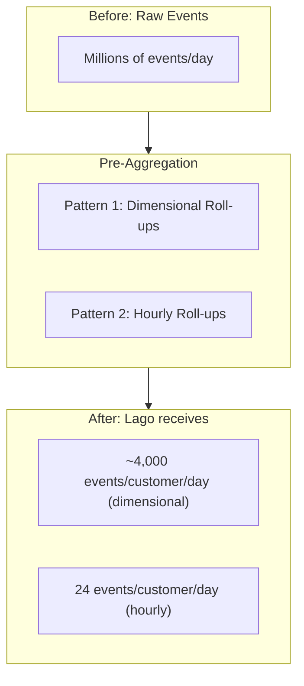

This page covers Lago's **event processing architecture**, **production benchmarks**, **throughput by connector**, and **optimization strategies**. It's the reference for engineering teams evaluating whether Lago can handle their event volume, and how to configure it for peak performance.

For event design, use cases, and integration code, see [Ingesting usage](/guide/events/ingesting-usage).

---

## Architecture: how Lago processes events at scale

Under the hood, Lago's high-volume pipeline is built on **Kafka/Redpanda** for streaming and **ClickHouse** for storage and aggregation.

### The pipeline

<Frame>
      
</Frame>

<Steps>
  <Step title="Raw ingestion">
    Event lands on `events_raw` Kafka topic, then persisted to `events_raw` ClickHouse table (audit trail).
  </Step>
  <Step title="Enrichment">
    Event processor evaluates custom expressions, extracts the metered value, matches to subscription/plan/charge, and applies charge filters (most-specific-match wins).
  </Step>
  <Step title="Enriched persistence">
    Enriched event written to `events_enriched` topic and ClickHouse table with full billing context.
  </Step>
  <Step title="Filter expansion">
    Events expanded across charge filter matches into `events_enriched_expanded` table for granular aggregation.
  </Step>
  <Step title="Pay-in-advance">
    Events matching pay-in-advance charges routed through `events_charged_in_advance` topic for immediate invoicing.
  </Step>
  <Step title="Billing aggregation">
    At invoice time, aggregation queries run directly on ClickHouse. Columnar storage enables billion-row aggregations in milliseconds.
  </Step>
</Steps>

### Why ClickHouse?

<CardGroup cols={2}>
  <Card title="10-20x compression">
    Compared to row stores. Billions of events stored efficiently.
  </Card>
  <Card title="Sub-second aggregation">
    Over massive datasets. Same queries power invoices and real-time usage dashboards.
  </Card>
  <Card title="Native Kafka integration">
    No ETL layer between Kafka and storage.
  </Card>
  <Card title="Full audit trail">
    Raw, enriched, and expanded events all queryable.
  </Card>
</CardGroup>

### Data tables

| Table | Contents | Purpose |
| --- | --- | --- |
| `events_raw` | Events exactly as received | Audit trail, debugging |
| `events_enriched` | Events + subscription, plan, charge, extracted value | Billing aggregation |
| `events_enriched_expanded` | Events expanded across charge filter matches | Dimensional billing |

### Self-hosted vs. Lago Cloud

<Tabs>
  <Tab title="Lago Cloud">
    ClickHouse and Kafka managed for you. You just send events.
  </Tab>
  <Tab title="Self-hosted">
    Full control over scaling, retention, and tuning. Requires manual administration of ClickHouse and Redpanda in your infrastructure.
  </Tab>
</Tabs>

For the full technical deep dive: [ClickHouse case study on Lago's architecture](https://clickhouse.com/blog/lago).

---

## Production benchmarks

<Frame caption="Usage ingestion benchmarks">
      
</Frame>

Numbers from Lago's internal load tests and customer deployments:

| What we measured | Result | Configuration |
| --- | --- | --- |
| Sustained ingestion | **1-3M events/sec** | ClickHouse Cloud + Kafka/Redpanda |
| Postgres-only throughput | **10K events/sec** | Single Postgres instance |
| Billing aggregation latency | **< 100ms p99** | Over 1B+ events in ClickHouse |
| End-to-end (event to billable) | **< 2 seconds p99** | Kafka to enrichment to ClickHouse |
| Storage compression | **10-20x** | ClickHouse columnar vs. raw JSON |

## Throughput by connector

| Connector | Sustained throughput | Latency (event to billable) | Setup complexity | Best for |
| --- | --- | --- | --- | --- |
| **REST API (single)** | ~1,000 events/sec | < 500ms | Minimal | Getting started, low volume |
| **REST API (batch)** | ~10,000 events/sec | < 500ms | Minimal | Moderate volume, no Kafka needed |
| **Kafka / Redpanda** | **1-3M events/sec** | < 1 sec p99 | Medium | High-volume real-time pipelines |
| **Amazon Kinesis** | **100K+ events/sec** | < 1 sec p99 | Medium | AWS-native architectures |
| **Amazon S3** | Batch, depends on size | Same as above | Low | Historical backfills, migrations |

<Tip>
  **REST batch can take you further than you think.** 10 parallel connections x 100 events per batch x 10 batches/sec = 10,000 events/sec with zero infrastructure beyond the Lago API. Many production deployments never need Kafka.
</Tip>

### REST API throughput optimization

Before moving to Kafka, maximize REST performance:

- **Always use the batch endpoint.** `/api/v1/events/batch` accepts up to 100 events per request.
- **Parallelize.** Send batch requests concurrently from multiple threads/workers.
- **Reuse connections.** HTTP keep-alive eliminates TLS handshake overhead.
- **Retry safely.** Events are idempotent by `transaction_id`, so retries on 429 or 5xx are always safe.

### Kafka / Redpanda configuration

Kafka ingestion requires the **ClickHouse event store** (see Architecture section above).

<AccordionGroup>
  <Accordion title="Lago Cloud">
    Lago Cloud includes a managed Kafka endpoint. Contact the team for your connection details (broker address, credentials, topic name). No infrastructure to deploy.
  </Accordion>
  <Accordion title="Self-hosted setup">
    Configure the Lago API to connect to your Kafka/Redpanda cluster:

    ```bash
    # Enable ClickHouse event store (required)
    LAGO_CLICKHOUSE_ENABLED=true

    # Kafka / Redpanda connection
    LAGO_KAFKA_BOOTSTRAP_SERVERS=redpanda.internal:9094
    LAGO_KAFKA_SECURITY_PROTOCOL=SASL_SSL
    LAGO_KAFKA_SASL_MECHANISM=SCRAM-SHA-256
    LAGO_KAFKA_USERNAME=lago
    LAGO_KAFKA_PASSWORD=<your-password>

    # Topic names (defaults shown)
    LAGO_KAFKA_RAW_EVENTS_TOPIC=events-raw
    LAGO_KAFKA_ENRICHED_EVENTS_TOPIC=events-enriched
    ```
  </Accordion>
  <Accordion title="Reader / producer tuning">
    Lago can directly consume events from your Kafka topic (which will require opening access to your Kafka broker / topic). Alternatively, you can send your events to a dedicated topic on our infrastructure (AWS VPC Peering or Private link).

    In this second case, these settings have the biggest impact on throughput:

    | Setting | Recommended | Why |
    | --- | --- | --- |
    | `linger.ms` | 20-100ms | Batches messages for fewer, larger network calls |
    | `batch.num.messages` | 500-5000 | Larger batches = higher throughput |
    | `compression.type` | `lz4` | 60-80% bandwidth reduction at 1M events/sec |
    | `enable.idempotence` | `true` | Exactly-once delivery to broker |
    | Message key | `external_subscription_id` | Preserves per-customer ordering |

    <Info>
      **Partition count:** Aim for partition count >= number of event processor instances. More partitions = more consumer parallelism.
    </Info>

    <Warning>
      **Consumer lag monitoring:** This is your #1 operational metric. Alert when lag exceeds your latency budget (e.g., > 100K messages).
    </Warning>
  </Accordion>
  <Accordion title="Redpanda on Kubernetes (self-hosted)">
    Minimal production deployment:

    ```yaml
    apiVersion: cluster.redpanda.com/v1alpha1
    kind: Redpanda
    metadata:
      name: redpanda
    spec:
      chartRef: {}
      clusterSpec:
        statefulset:
          replicas: 3
        auth:
          sasl:
            enabled: true
            users:
              - name: lago
                password: <your-password>
        resources:
          memory: { container: { max: 4Gi } }
          cpu: { cores: 2 }
        storage:
          persistentVolume: { size: 100Gi }
    ```

    See [Redpanda Operator docs](https://docs.redpanda.com/current/deploy/deployment-option/self-hosted/kubernetes/) for TLS, rack awareness, and tiered storage.

    <Note>
      ClickHouse on Kubernetes documentation is coming soon.
    </Note>
  </Accordion>
</AccordionGroup>

### Amazon Kinesis configuration

<Accordion title="Kinesis setup">
  We can read directly events from your Kinesis stream. We'll need:

  - Kinesis Stream ARN
  - Credentials:
    - Role ARN to assume, or
    - IAM Access Keys
</Accordion>

### Amazon S3 configuration

<AccordionGroup>
  <Accordion title="File format">
    Newline-delimited JSON (`.jsonl` or `.jsonl.gz`). Target 100MB-1GB per compressed file.

    <Info>
      **Idempotent:** Re-running an import after failure is always safe (dedup by `transaction_id`).
    </Info>
  </Accordion>
  <Accordion title="S3 setup">
    We generally provide an S3 Bucket on our infrastructure where you can deliver your files, along with credentials to upload new files.

    If you prefer to provide your own S3 Bucket, an SQS Queue is required to capture new file uploads (configurable on the S3 Bucket properties/notifications). We would need:

    - S3 Bucket
    - S3 Region
    - SQS URL
    - Credentials:
      - Role ARN to assume, or
      - IAM Access Keys
  </Accordion>
</AccordionGroup>

---

## Migrating from REST to Kafka

When you outgrow the REST API:

<Steps>
  <Step title="No schema changes">
    Event format is identical across all methods.
  </Step>
  <Step title="Run both in parallel">
    Send new events via Kafka while existing REST producers still work. Both paths feed the same pipeline.
  </Step>
  <Step title="Validate parity">
    Compare event counts and billing outputs.
  </Step>
  <Step title="Cut over">
    Redirect all producers to Kafka.
  </Step>
</Steps>

## Pre-aggregation: an advanced optimization

If you've already maximized your connector throughput and scaled your infrastructure, but still need to reduce pipeline load, you can aggregate events at the source before sending them to Lago. This is a technique for extreme volumes; most deployments never need it.



<Info>
  **When it works:** Your billable metric uses `SUM`, `COUNT`, or `MAX` aggregation.

  **When it doesn't:** You need per-event pricing (each event has a different amount) or per-event audit trail.
</Info>

### Pattern 1: Dimensional roll-ups

This is the most common pre-aggregation pattern. It applies when your pricing depends on one or more dimensions (region, instance type, model, tier) and you use a `SUM` or `COUNT` aggregation with charge filters in Lago.

Instead of sending one event per unit of work, you aggregate all usage for each unique combination of billing dimensions into a single event per time window. Lago's charge filters still match on the dimension values in `properties`, so billing accuracy is preserved.

**Use case:** A cloud provider bills compute usage by instance type and region. Each VM emits a heartbeat every minute. That is 1,440 events per VM per day. With 400 instance types across 10 regions, raw volume can reach millions of events per customer per day.

**With dimensional roll-ups:** One event per customer per instance type per region per day. Even at 400 instance types x 10 regions, that is at most ~4,000 events/customer/day instead of millions.

```json
{
  "transaction_id": "agg_cust42_compute_a100_useast_2024-03-14",
  "external_subscription_id": "sub_42",
  "code": "compute_hours",
  "timestamp": 1710460800,
  "properties": {
    "instance_type": "gpu-a100-80gb",
    "region": "us-east-1",
    "hours": 48.5
  }
}
```

The `instance_type` and `region` fields in `properties` are the dimensions that Lago's charge filters match against. Your `SUM` aggregation runs on `hours`. Because each combination is aggregated separately, the billing output is identical to sending raw events.

Multiple Lago customers run this pattern in production.

### Pattern 2: Hourly roll-ups

When your billable metric has no dimensional breakdown (e.g., total API calls, total tokens), you can collapse each hour into one event per customer. We recommend 1-hour windows as the maximum aggregation frequency to keep near-real-time billing visibility.

**Before:** 3,600 events/hour per customer (1 per second)

**After:** 1 event/hour per customer, a **3,600x volume reduction** (24 events/day instead of 86,400)

```json
{
  "transaction_id": "agg_cust42_api_calls_2024-03-14T10",
  "external_subscription_id": "sub_42",
  "code": "api_calls",
  "timestamp": 1710414000,
  "properties": {
    "total_tokens": 520000,
    "request_count": 3600
  }
}
```

This works best with `SUM` or `COUNT` aggregations where no charge filters are applied. The `transaction_id` includes the hour (`T10`) to ensure uniqueness across windows.

### Choosing an aggregation window

| Window | Trade-off |
| --- | --- |
| **No aggregation** | Default. Send every event as it happens. Simplest to implement, full real-time visibility. Start here and only pre-aggregate if you hit throughput limits. |
| **1 minute** | Minimal delay. Useful when you need near-real-time billing but your raw event rate per dimension is very high (e.g., thousands of events/sec per subscription). |
| **1 hour** | Recommended for most pre-aggregation scenarios. Good balance between volume reduction and billing visibility. |
| **24 hours** | Maximum volume reduction. Usage only visible the next day. Best suited for non-critical billing where real-time visibility is not required (e.g., internal cost allocation, post-hoc reporting). |


## Monitoring checklist

| Metric | What it tells you | Alert when |
| --- | --- | --- |
| **Kafka consumer lag** | Is Lago keeping up with event volume? | Lag > 100K messages |
| **Ingestion rate** (events/sec) | Baseline throughput | > 50% deviation from baseline |
| **Enrichment latency** | Time from raw to enriched event | p99 > 2 seconds |
| **Validation failures** | Events rejected for schema errors (only applicable to REST API) | Any sustained increase |