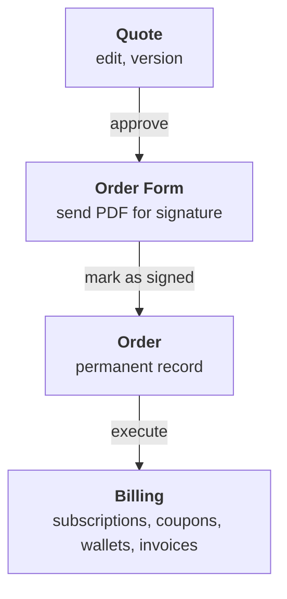

<Info>
  **PREMIUM ADD-ON** ✨

  This quotes feature is available upon request only. Please [**contact us**](mailto:hello@getlago.com) to get access to this premium feature.
</Info>

Quotes & Order Forms lets you build pricing proposals directly in Lago, assembled from your catalog: plans, coupons, prepaid credits, add-ons. When the deal closes, the same configuration provisions billing. What you quote is what gets billed.

## From quote to order

Three documents, each created from the previous one:

1. A **Quote** is the internal negotiation document. Editable, versioned.
2. An **Order Form** is generated when you approve a quote. Frozen. You download the PDF and send it for signature.
3. An **Order** is created when you mark the order form as signed. Permanent record. Executing it provisions billing in Lago, or records the deal if billing runs elsewhere.

## Statuses at a glance

| Document | Statuses |
| --- | --- |
| Quote version | `draft`, `approved`, `voided` |
| Order form | `generated`, `signed`, `expired`, `voided` |
| Order | `created`, `executed`, `failed` |

Each step has its own page: [creating a quote](/guide/quotes/create-a-quote), [writing the content](/guide/quotes/quote-editor), [order forms](/guide/quotes/order-forms), [orders](/guide/quotes/orders). Read the [limitations](/guide/quotes/limitations) before building a workflow around the feature.

## Over the API

Quotes are authored in Lago: the editor, the catalog picker, the variables. The API covers everything after that, so a CRM or a signature tool can drive the lifecycle without anyone opening Lago.

| Step | Endpoint |
| --- | --- |
| Read a quote and its versions | [`GET /quotes/{lago_id}`](/api-reference/quotes/get-specific), [`GET /quotes/{lago_id}/versions`](/api-reference/quotes/get-all-versions) |
| Approve a draft, generating the order form | [`POST /quote_versions/{lago_id}/approve`](/api-reference/quotes/approve-version) |
| Renegotiate | [`POST /quote_versions/{lago_id}/clone`](/api-reference/quotes/clone-version), [`POST /quote_versions/{lago_id}/void`](/api-reference/quotes/void-version) |
| Record the signature, creating the order | [`POST /order_forms/{lago_id}/mark_as_signed`](/api-reference/quotes/order-forms/mark-as-signed) |
| Withdraw an unsigned order form | [`POST /order_forms/{lago_id}/void`](/api-reference/quotes/order-forms/void) |
| Provision billing on demand | [`POST /orders/{lago_id}/execute`](/api-reference/quotes/orders/execute) |

Nine webhooks follow the same path: `quote.created`, `quote.approved`, `quote.voided`, `order_form.created`, `order_form.signed`, `order_form.expired`, `order_form.voided`, `order.created`, `order.executed`. See the [full list](/api-reference/webhooks/messages#quotes-and-orders).

Clients for [Ruby](https://github.com/getlago/lago-ruby-client), [Python](https://github.com/getlago/lago-python-client) and [Go](https://github.com/getlago/lago-go-client) cover the three resources. The [JavaScript client](https://github.com/getlago/lago-javascript-client) is generated from the OpenAPI spec, so it picks them up on its next release.

## Permissions

Quotes & Order Forms follows Lago's [roles and permissions](/guide/security/rbac). Admins and managers can perform every action. Finance is view-only.
