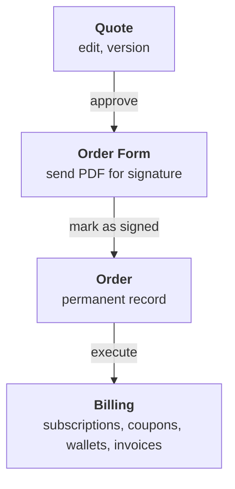

<Info>
  **PREMIUM ADD-ON** ✨

  This quotes feature is available upon request only. Please [**contact us**](mailto:hello@getlago.com) to get access to this premium feature.
</Info>

Quotes & Order Forms lets you build pricing proposals directly in Lago, assembled from your catalog: plans, coupons, prepaid credits, add-ons. When the deal closes, the same configuration provisions billing. What you quote is what gets billed.

## From quote to order

Three documents, each created from the previous one:

1. A **Quote** is the internal negotiation document. Editable, versioned.
2. An **Order Form** is generated when you approve a quote. Frozen. You download the PDF and send it for signature.
3. An **Order** is created when you mark the order form as signed. Permanent record. Executing it provisions billing in Lago, or records the deal if billing runs elsewhere.

## Statuses at a glance

| Document | Statuses |
| --- | --- |
| Quote version | `draft`, `approved`, `voided` |
| Order form | `generated`, `signed`, `expired`, `voided` |
| Order | `created`, `executed` |

Each step has its own page: [creating a quote](/guide/quotes/create-a-quote), [writing the content](/guide/quotes/quote-editor), [order forms](/guide/quotes/order-forms), [orders](/guide/quotes/orders). Read the [limitations](/guide/quotes/limitations) before building a workflow around the feature.

## Permissions

Quotes & Order Forms follows Lago's [roles and permissions](/guide/security/rbac). Admins and managers can perform every action. Finance is view-only.
