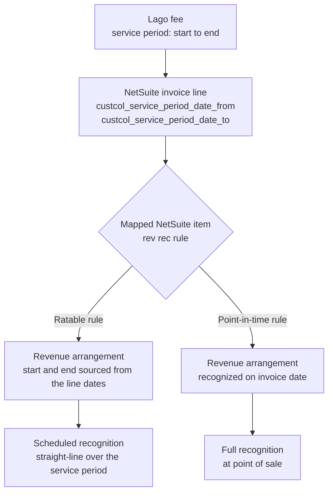
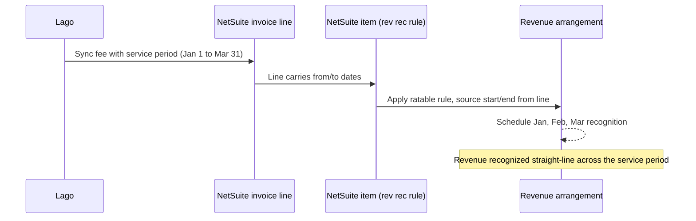

<Info>
**PREMIUM ADD-ON** ✨

This integration is available upon request only. Please **[contact us](mailto:hello@getlago.com)** to get access to this premium integration.
</Info>

Lago's native NetSuite integration runs as a **Lago bundle** you install into your NetSuite account. A bundle (or SuiteBundle) is a packaged set of customizations you install in one step. The Lago bundle installs everything the integration needs, and you configure it from a single **Lago Configuration** record inside NetSuite. There is no script to paste and no mapping to maintain in Lago.

<Info>
Lago maintains this integration internally using SuiteCloud Development Framework (SDF). You don't interact with SDF: everything you need ships in the bundle.
</Info>

## How it works

Two directions of traffic, both authenticated:

- **Lago → NetSuite.** Lago calls the bundle's [RESTlet](https://docs.oracle.com/en/cloud/saas/netsuite/ns-online-help/section_4618456517.html) (a server-side script that exposes a secure URL) to create and update invoices, credit memos, customers, and payments in real time.
- **NetSuite → Lago.** Bundle scripts call the Lago API to pull your Lago objects (plans, coupons, taxes, add-ons, billable metrics, billing entities) into NetSuite for mapping, and to push payments recorded in NetSuite back to Lago.

You configure both from the Lago Configuration record: the Lago endpoint and API key drive the NetSuite → Lago calls, and the mappings on that record tell the RESTlet how to turn Lago data into NetSuite records.

## Setup

Complete every step in this section before syncing any data.

### Install the Lago bundle

Go to **Customization > SuiteBundler > Search & Install Bundles**, locate the Lago bundle, and install it. The install adds:

- **Lago | Service** RESTlet (`customscript_lago_service` / deployment `customdeploy_lago_service`): the endpoint Lago calls to create and update records. Its deployment generates the **custom RESTlet endpoint URL**;
- **Lago | Fetch Objects** MapReduce (`customscript_lago_fetch_objects`) and **Lago | Trigger Fetch** Suitelet (`customscript_lago_trigger_fetch`): pull your Lago objects into NetSuite;
- **Lago | Configuration** user event script (`customscript_lago_configuration_ue`): adds the configuration buttons and seeds standard field mappings;
- **Lago | Payment Sync** user event script (`customscript_lago_payment_sync`): pushes NetSuite customer payments back to Lago;
- The **Lago Configuration** and mapping custom records, plus the synced **Lago Object** record;
- A web-services-only **Lago Integration Role** with the permissions the integration uses; and
- Custom fields that link records back to Lago: **Lago ID** on customers and transactions, **Lago Line ID** on transaction lines, and the service-period columns described in [revenue recognition](#building-revenue-recognition-rules-in-netsuite-from-lago-line-items).

<Steps>
  <Step title="Step 1: Enable the required SuiteCloud features">
    Go to **Setup > Company > Enable Features > SuiteCloud** and enable **Server SuiteScript**, **Custom Records**, and **REST Web Services**. Your account also needs the standard **Accounting** and **Subsidiaries** features, which most accounts already have.
  </Step>
  <Step title="Step 2: Install the bundle">
    From **Customization > SuiteBundler > Search & Install Bundles**, install the Lago bundle. This adds the scripts, records, role, and custom fields listed above.
  </Step>
  <Step title="Step 3: Confirm the deployment is Released">
    Open **Customization > Scripting > Script Deployments**, find the `Lago Service` deployment (`customdeploy_lago_service`), and make sure its status is `Released`. The deployment page shows the **custom RESTlet endpoint URL** that Lago uses to reach your account.
  </Step>
</Steps>

{/* TODO screenshot: Lago bundle install / Released Lago Service deployment with endpoint URL */}

<Info>
The Lago → NetSuite connection (the RESTlet endpoint and the credentials Lago uses to call it) is established with your Lago contact during onboarding. The steps below configure everything on the NetSuite side.
</Info>

### Add your Lago API key

The bundle scripts call the Lago API using a key stored as a NetSuite **script secret**, so the key is encrypted at rest and never appears in script logs.

1. In NetSuite, go to **Setup > Company > API Secrets** and create a new secret;
2. Paste your Lago API key as the value;
3. Restrict the secret to your account domain and to the Lago scripts; and
4. Save. The scripts reference it by its ID, `custsecret_lago_api_key`.

{/* TODO screenshot: NetSuite API secret for the Lago API key */}

### Create the Lago Configuration record

The Lago Configuration record is the hub for the whole integration. Create one active record and fill in the connection details:

- **Active**: mark this record as the active configuration;
- **Lago Endpoint Url**: your Lago API base URL (defaults to `https://api.getlago.com/api/v1`; use your self-hosted URL if applicable);
- **Lago Region** and **Organization ID**: select your region and enter your Lago organization ID; and
- **Sync Payments**: enable this to push NetSuite customer payments back to Lago.

The record also holds **default objects** that act as fallbacks when no specific mapping matches: Default Item, Default Tax Nexus / Type / Code, Default Coupon, Default Credit Note, Default Subscription Fee, Default Plans Minimum Commitment, and Default Prepaid Credits. Set the ones relevant to your billing.

<Info>
When you create the record, the bundle seeds the **standard invoice field mappings** (header and line) automatically. You can re-run this at any time with the **Populate Standard Fields** button on the record.
</Info>

{/* TODO screenshot: Lago Configuration record with connection fields and defaults */}

### Fetch your Lago objects

Before you can map anything, pull your Lago objects into NetSuite. On the Lago Configuration record, click **Fetch Objects from Lago**. The bundle calls the Lago API and stores each object as a **Lago Object** record (`customrecord_lago_object`) you can select in the mapping tabs.

It fetches:

- Plans;
- Coupons;
- Taxes;
- Add-ons;
- Billable metrics; and
- Billing entities.

Re-run the fetch whenever you add objects in Lago so the new ones are available to map.

{/* TODO screenshot: Fetch Objects from Lago button and resulting Lago Object records */}

### Configure the mappings

Mappings live on the subtabs of the Lago Configuration record. Each can be scoped to a **Billing Entity** so different Lago billing entities map differently, or left generic to apply across all of them.

- **Item Mapping**: map each Lago Object (plan, add-on, billable metric, and so on) to a **NetSuite Item**. Lago fees that don't match a specific item fall back to the configuration's Default Item;
- **Tax Mapping**: map each Lago Tax to a NetSuite **Tax Nexus**, **Tax Type**, and **Tax Code**. This is how Lago's tax amounts are applied to NetSuite transactions. Unmatched taxes fall back to the configuration's default nexus, type, and code;
- **Subsidiary Mapping**: map each Lago **Billing Entity** to a NetSuite **Subsidiary**;
- **Currency Mapping**: map each Lago **Currency** to a NetSuite **Currency**; and
- **Invoice Mapping**: the header and line field mappings the bundle seeds for you. Most accounts leave these as-is; adjust them only for advanced field-level customization.

<Info>
**Tax resolution order.** For each invoice, the integration matches a tax mapping by Lago tax **and** billing entity first, then by Lago tax alone, then by billing entity alone, and finally falls back to the configuration defaults. **Item resolution** is similar: a billing-entity-specific item mapping wins over a generic one, which wins over the Default Item.
</Info>

{/* TODO screenshot: Lago Configuration mapping subtabs (Item, Tax, Subsidiary, Currency) */}

## Syncs

### Customers synchronization

When creating or updating a Lago customer, you can link it to a NetSuite customer. Lago stores the link on the customer's **Lago ID** field (`custentity_lago_id`), and the RESTlet uses that ID to avoid creating duplicates.

You have two options:

- **Auto-create from Lago.** Lago creates a matching customer in NetSuite the first time it syncs. The Lago customer view then shows a direct link to the NetSuite customer; or
- **Import an existing NetSuite customer.** Provide the NetSuite customer ID on the Lago customer so the two are linked without creating a new record.

<Info>
Customer creation from Lago to NetSuite happens in real-time with only a few seconds of delay.
</Info>

<Frame caption="Lago customer integrated with NetSuite">
  
</Frame>

### Invoices synchronization

If a Lago customer is linked to a NetSuite customer, Lago syncs invoices to NetSuite Invoices in real-time through the RESTlet.

It's important to note the following:

- Each fee issued by Lago is synced as a line item on a NetSuite invoice;
- The Lago fee `units` are synced to NetSuite as `quantity`;
- The Lago fee `precise_unit_amount` is synced to NetSuite as `rate`;
- Taxes are applied from your **Tax Mapping**, since NetSuite does not support tax details at the line item level; and
- Any discounts on an invoice (coupon, credit note, or prepaid credits) are synced as negative line items, mapped through the configuration's default objects.

If the invoice is created successfully, the Lago invoice view shows a direct link to the NetSuite invoice.

<Info>
Invoice creation from Lago to NetSuite happens in real-time with only a few seconds of delay.
</Info>

<Frame caption="Sync Lago invoices to NetSuite">
  
</Frame>

### Credit Notes synchronization

If a Lago customer is linked to a NetSuite customer, Lago syncs credit notes to NetSuite Credit Memos in real-time.

- Each fee refunded by Lago is synced as a line item on a NetSuite Credit Memo;
- Taxes are applied from your Tax Mapping, as with invoices; and
- Any discounts on a credit note are synced as line items on the NetSuite Credit Memo.

The Lago credit note view shows a direct link to the corresponding NetSuite Credit Memo once it's created.

### Payments synchronization

Payments sync in both directions when **Sync Payments** is enabled on the Lago Configuration record:

- **Lago → NetSuite.** When a Lago invoice is tied to a NetSuite invoice, Lago updates the NetSuite invoice's payment status in real time; and
- **NetSuite → Lago.** When you record a Customer Payment in NetSuite, the **Lago | Payment Sync** script pushes the applied amount back to Lago.

### Integration logs

Whenever an issue occurs in NetSuite, Lago notifies you through a [webhook message](/api-reference/webhooks/messages#accounting-provider-error) called `customer.accounting_provider_error`.
You can also **view the bundle's script execution logs inside NetSuite** for troubleshooting and auditing.

## Building revenue recognition rules in NetSuite from Lago line items

Revenue recognition is the accounting practice of recording revenue as it's earned, not when it's billed. NetSuite handles this with its Advanced Revenue Management module: an item-level **revenue recognition rule** defines *how* revenue is recognized, and NetSuite generates a **revenue arrangement** and a recognition schedule from each transaction line.

Lago feeds that engine directly. You don't build manual schedules. You let NetSuite derive them from the line items Lago syncs.

### How Lago line items carry the service period

Every Lago fee syncs as one NetSuite invoice line item. For each line, the bundle populates two date columns with the fee's service period:

- `custcol_service_period_date_from`: the service period start date; and
- `custcol_service_period_date_to`: the service period end date.

These two dates are the input NetSuite needs to spread revenue over time. On the NetSuite item, set the revenue recognition rule's **Rev Rec Start Date Source** to `custcol_service_period_date_from` and its **Rev Rec End Date Source** to `custcol_service_period_date_to`. NetSuite then schedules recognition across exactly the period Lago billed, with no manual entry.

### Ratable vs. point-in-time

Not every fee should be recognized the same way. The rule lives on the NetSuite item, so map each Lago object to an item that carries the right rule:

- **Ratable (over time).** Subscription fees and minimum commitments carry a real service period (for example, a monthly or annual term). Map them to items with a ratable, straight-line rule so revenue spreads evenly from the line's service-period start to its end.
- **Point-in-time.** One-off charges (add-ons) and usage-based fees are earned when billed. Their service period is effectively a single instant. Map them to items with a point-in-time rule so revenue is recognized in full on the invoice date.

<Info>
The recognition behavior is determined by the rule on the mapped NetSuite item, not by Lago. Use the [Item Mapping](#configure-the-mappings) to send each Lago object to an item that carries the correct rev rec rule.
</Info>

### Conceptual flow

The diagram below shows the same path for a single subscription line recognized over its term.

{/*
## Changelog vs. previous version
NOT FOR PUBLICATION — reviewer diff aid only. Remove before merge.

Source of truth: getlago/lago-netsuite-sdf (CLAUDE.md + actual SDF code), per Raffi.

- Replaced the entire legacy setup model. Removed: the manual ramda.min.js + pasted-script + hand-deploy flow; the manual Tax Nexus/Type/Code creation walkthrough; the Define Taxable Items section; the Remove Locations section; the Lago-side item/currency mapping UI; and the TBA/OAuth "Connect Lago to NetSuite" auth flow (create integration, create token, Lago-side auth fields).
- New model is config-record-driven inside NetSuite: install bundle -> add Lago API key as the custsecret_lago_api_key script secret -> create the Lago Configuration record (endpoint/region/org id/sync payments + default objects) -> Fetch Objects from Lago -> configure mappings on the config subtabs (Item, Tax, Subsidiary, Currency, Invoice).
- Documented actual bundle output from the SDF objects: scripts Lago | Service (customscript_lago_service / customdeploy_lago_service), Lago | Fetch Objects (customscript_lago_fetch_objects), Lago | Trigger Fetch (customscript_lago_trigger_fetch), Lago | Configuration (customscript_lago_configuration_ue), Lago | Payment Sync (customscript_lago_payment_sync); the Lago Configuration + mapping records; the Lago Integration Role; and the Lago ID / Lago Line ID / service-period custom fields. NOTE: CLAUDE.md lists the RESTlet IDs with a _rl suffix; the SDF object XML uses no suffix (customscript_lago_service). I used the XML (authoritative for what deploys).
- Documented the two-way flow: Lago -> NetSuite via the RESTlet (invoices, credit memos, customers, payments); NetSuite -> Lago via Fetch Objects and Payment Sync (Bearer custsecret_lago_api_key).
- Added tax-resolution and item-resolution priority notes (from CLAUDE.md / Lago_Helpers).
- Payments section now documents both directions, gated on the Sync Payments toggle.
- Kept the PREMIUM ADD-ON callout, the rev rec section (service-period columns -> rev rec rule), and the integration-logs webhook. Kept only the two still-valid Lago-side screenshots (sync-customers, sync-invoices); all other legacy NetSuite/Lago screenshots dropped; new NetSuite-config steps use TODO screenshot placeholders. No bundle source/ID/location stated anywhere.

OPEN ITEMS for reviewer:
- Confirm the "Setup > Company > API Secrets" menu path for creating the script secret.
- Confirm the Lago Region option values and whether a non-default endpoint (EU/self-hosted) needs calling out.
- Inbound auth (how Lago authenticates into the RESTlet) is described only as "established with your Lago contact during onboarding," since the TBA flow was dropped per instruction. Confirm this is the intended customer-facing treatment.
*/}
