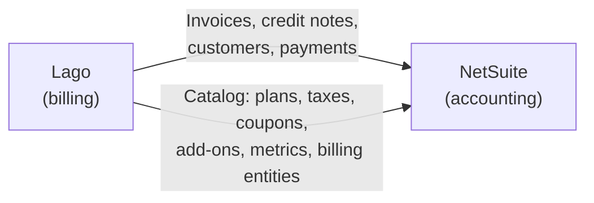
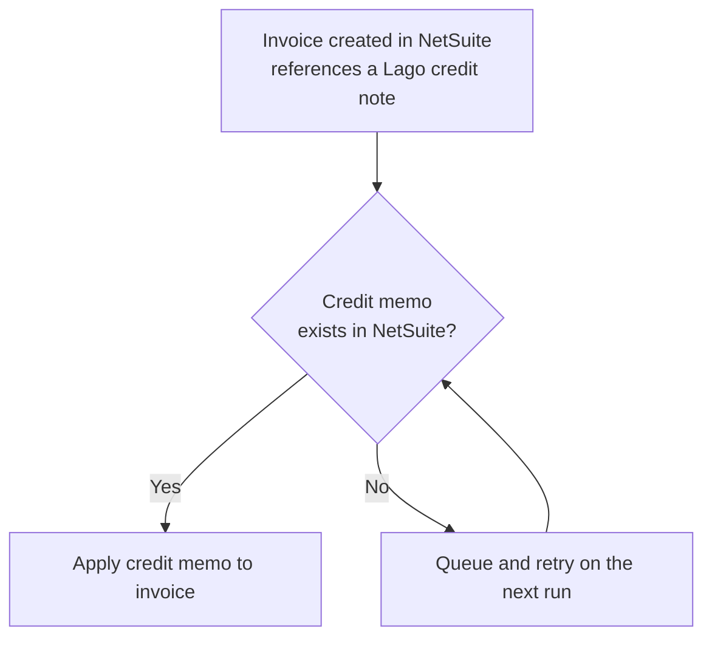
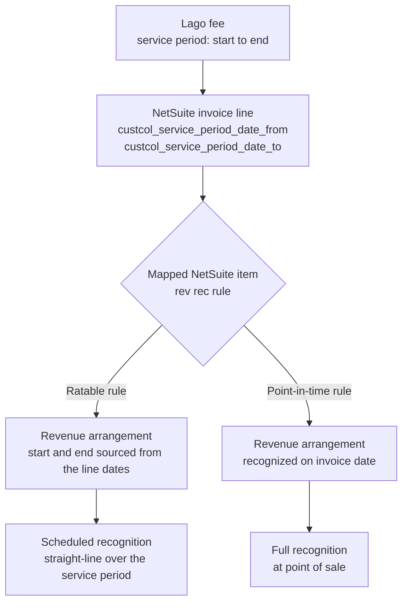
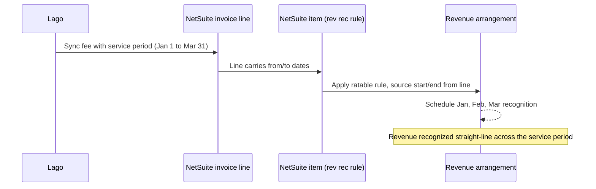

<Info>
**PREMIUM ADD-ON** ✨

This integration is available upon request only. Please **[contact us](mailto:hello@getlago.com)** to get access to this premium integration.
</Info>

Lago handles usage-based billing: it meters usage, applies plans and coupons, and produces invoices. NetSuite is where your finance team does accounting. This integration keeps the two in sync automatically, so invoices, credit notes, and payments created in Lago appear in NetSuite as real, tax-accurate transactions with no manual re-entry.

It runs as a **Lago bundle** you install into your NetSuite account. A bundle (or SuiteBundle) is a packaged set of customizations you install in one step. You then configure everything from a single **Lago Configuration** record inside NetSuite. There is no script to paste and no mapping to maintain in Lago.

<Info>
Lago maintains this integration internally using SuiteCloud Development Framework (SDF). You don't interact with SDF: everything you need ships in the bundle.
</Info>

## How it works

Data flows from Lago into NetSuite along three paths:

- **Documents.** When Lago finalizes an invoice or issues a credit note, it calls the bundle's [RESTlet](https://docs.oracle.com/en/cloud/saas/netsuite/ns-online-help/section_4618456517.html) (a server-side script that exposes a secure URL) to create a NetSuite Invoice or Credit Memo in real time.
- **Payments.** When a payment is recorded in Lago, it's pushed to the RESTlet and created as a NetSuite Customer Payment, applied to the matching invoice so it shows as paid.
- **Catalog.** One click on the configuration record pulls your Lago catalog (plans, taxes, coupons, add-ons, billable metrics, billing entities) into NetSuite as reference objects, so you build mappings from dropdowns instead of copying IDs.

**Authentication.** NetSuite calls Lago using an API key stored as a NetSuite secret, so the key never appears in scripts, logs, or records. Lago calls the RESTlet using NetSuite's standard token-based authentication, scoped to the restricted **Lago Integration Role** the bundle installs.

## Setup

Complete every step in this section before syncing any data.

### Install the Lago bundle

Go to **Customization > SuiteBundler > Search & Install Bundles**, locate the Lago bundle, and install it. The install adds:

- **Lago | Service** RESTlet (`customscript_lago_service` / deployment `customdeploy_lago_service`): the endpoint Lago calls to create and update records. Its deployment generates the **custom RESTlet endpoint URL**;
- **Lago | Fetch Objects** MapReduce (`customscript_lago_fetch_objects`) and **Lago | Trigger Fetch** Suitelet (`customscript_lago_trigger_fetch`): pull your Lago catalog into NetSuite;
- **Lago | Configuration** user event script (`customscript_lago_configuration_ue`): adds the configuration buttons and seeds standard field mappings;
- An **async processing queue** (MapReduce + processing records): applies credit memos and retries work when webhooks arrive out of order;
- The **Lago Configuration** record, the mapping records (item, tax, subsidiary, currency, invoice header/line, charge-grouping rules), and the synced **Lago Object** record;
- A web-services-only **Lago Integration Role** with the permissions the integration uses; and
- Custom fields that link records back to Lago: **Lago ID** on customers and transactions, **Lago Line ID** on transaction lines, and the service-period columns described in [revenue recognition](#building-revenue-recognition-rules-in-netsuite-from-lago-line-items).

<Steps>
  <Step title="Step 1: Enable the required SuiteCloud features">
    Go to **Setup > Company > Enable Features > SuiteCloud** and enable **Server SuiteScript**, **Custom Records**, **REST Web Services**, and **Token-Based Authentication**. Your account also needs the standard **Accounting** and **Subsidiaries** features, which most accounts already have.
  </Step>
  <Step title="Step 2: Install the bundle">
    From **Customization > SuiteBundler > Search & Install Bundles**, install the Lago bundle. This adds the scripts, records, role, and custom fields listed above.
  </Step>
  <Step title="Step 3: Confirm the deployment is Released">
    Open **Customization > Scripting > Script Deployments**, find the `Lago Service` deployment (`customdeploy_lago_service`), and make sure its status is `Released`. The deployment page shows the **custom RESTlet endpoint URL** that Lago uses to reach your account.
  </Step>
</Steps>

{/* TODO screenshot: Lago bundle install / Released Lago Service deployment with endpoint URL */}

<Info>
The credentials Lago uses to call the RESTlet (token-based authentication under the Lago Integration Role) are configured with your Lago contact during onboarding. The steps below configure everything on the NetSuite side.
</Info>

### Add your Lago API key

The bundle scripts call the Lago API using a key stored as a NetSuite **secret**, so the key is encrypted at rest and never appears in script logs.

1. In NetSuite, go to your secrets management page (**Setup > Company > API Secrets**) and create a new secret;
2. Paste your Lago API key as the value;
3. Restrict the secret to your account domain and to the Lago scripts; and
4. Save. The scripts reference it by its ID, `custsecret_lago_api_key`.

{/* TODO screenshot: NetSuite secret for the Lago API key */}

### Create the Lago Configuration record

The Lago Configuration record is the hub for the whole integration. Create one active record and fill in the connection details:

- **Active**: mark this record as the active configuration;
- **Lago Endpoint Url**: your Lago API base URL (defaults to `https://api.getlago.com/api/v1`; use your region or self-hosted URL if applicable);
- **Lago Region** and **Organization ID**: select your region and enter your Lago organization ID.

The record also holds **default objects** that act as a safety net when no specific mapping matches: Default Item, Default Tax Nexus / Type / Code, Default Coupon, Default Credit Note, Default Subscription Fee, Default Plans Minimum Commitment, and Default Prepaid Credits. Nothing fails just because a mapping is missing. The invoice is created using the defaults.

<Info>
When you create the record, the bundle seeds the **standard invoice field mappings** (header and line) automatically. You can re-run this at any time with the **Populate Standard Fields** button on the record.
</Info>

{/* TODO screenshot: Lago Configuration record with connection fields and defaults */}

### Fetch your Lago catalog

Before you can map anything, pull your Lago catalog into NetSuite. On the Lago Configuration record, click **Fetch Objects from Lago**. The bundle calls the Lago API and stores each object as a **Lago Object** record (`customrecord_lago_object`) you can select in the mapping tabs.

It fetches plans, coupons, taxes, add-ons, billable metrics, and billing entities. Re-run the fetch whenever you add objects in Lago so the new ones are available to map.

{/* TODO screenshot: Fetch Objects from Lago button and resulting Lago Object records */}

### Configure the mappings

Mappings live on the subtabs of the Lago Configuration record. Each can be scoped to a **Billing Entity** so different Lago billing entities map differently, or left generic to apply across all of them.

- **Item Mapping**: map each Lago object (plan, add-on, billable metric, and so on) to a **NetSuite Item**;
- **Tax Mapping**: map each Lago tax to a NetSuite **Tax Nexus**, **Tax Type**, and **Tax Code**. This is how Lago's tax amounts are applied to NetSuite transactions;
- **Subsidiary Mapping**: map each Lago **Billing Entity** to a NetSuite **Subsidiary**;
- **Currency Mapping**: map each Lago **Currency** to a NetSuite **Currency**; and
- **Invoice Mapping**: the header and line field mappings the bundle seeds for you. Most accounts leave these as-is; adjust them only for advanced field-level customization.

<Info>
**Tax resolution order.** For each invoice, the integration matches a tax mapping by Lago tax **and** billing entity first, then by Lago tax alone, then by billing entity alone, and finally falls back to the configuration defaults. **Item resolution** is similar: a billing-entity-specific item mapping wins over a generic one, then a type-based default (subscription fee, minimum commitment, and so on), then the Default Item.
</Info>

{/* TODO screenshot: Lago Configuration mapping subtabs (Item, Tax, Subsidiary, Currency) */}

## Syncs

### Customers synchronization

When creating or updating a Lago customer, you can link it to a NetSuite customer. Lago stores the link on the customer's **Lago ID** field (`custentity_lago_id`), and the RESTlet uses that ID to avoid creating duplicates.

You have two options:

- **Auto-create from Lago.** Lago creates a matching customer in NetSuite the first time it syncs. The Lago customer view then shows a direct link to the NetSuite customer; or
- **Import an existing NetSuite customer.** Provide the NetSuite customer ID on the Lago customer so the two are linked without creating a new record.

<Info>
Customer creation from Lago to NetSuite happens in real-time with only a few seconds of delay.
</Info>

<Frame caption="Lago customer integrated with NetSuite">
  
</Frame>

### Invoices synchronization

When Lago finalizes an invoice for a linked customer, it syncs to a NetSuite Invoice in real time. The NetSuite invoice gets:

- **One line per Lago fee**, on the mapped item, with the Lago fee `units` as `quantity` and `precise_unit_amount` as `rate`;
- **Coupons, credit notes, and prepaid (wallet) credits** as negative lines, so the NetSuite total matches what the customer owes;
- **Taxes** from your Tax Mapping, reconciled against Lago's totals to the cent (NetSuite does not support tax details at the line item level, so the integration adjusts rounding so the totals never drift); and
- **Links back to Lago**: the Lago invoice view shows a direct link to the NetSuite invoice, and the NetSuite invoice stores its Lago ID and a URL back to Lago.

<Info>
Invoice creation from Lago to NetSuite happens in real-time with only a few seconds of delay.
</Info>

<Frame caption="Sync Lago invoices to NetSuite">
  
</Frame>

#### Optional: grouped charge lines

If your invoices carry many small usage lines (for example, one per metric or model), you can enable **charge grouping** to combine all usage-charge lines into a single invoice line on an item you choose, with a description listing what was included. Grouping rules let you restrict when this happens, for example only for certain customers or invoice types.

### Credit Notes synchronization

When a credit note is issued in Lago for a linked customer, it syncs to a NetSuite Credit Memo in real time, following the same line and tax logic as invoices. When the credit note offsets an existing invoice, the credit memo is **automatically applied to the original invoice**.

The Lago credit note view shows a direct link to the corresponding NetSuite Credit Memo once it's created.

### Payments synchronization

When a payment is recorded in Lago for a linked invoice, it's pushed to NetSuite as a **Customer Payment** and applied to the matching invoice, so the invoice shows as paid (full or partial) on both sides.

<Info>
Reporting NetSuite-side payments back to Lago (the NetSuite → Lago direction) is in development and not yet a supported flow. A **Sync Payments** toggle for it exists on the configuration record.
</Info>

### Reliability and reconciliation

The integration is built to run unattended:

- **No duplicates.** Every record carries its Lago ID. If the same invoice, credit note, or customer is sent twice, the integration detects it and refuses to create a second copy.
- **Totals match.** Tax amounts are reconciled against Lago's totals, including rounding, so the NetSuite invoice never drifts by a penny.
- **Out-of-order events sort themselves out.** If a credit note arrives before the invoice it applies to (or vice versa), the integration queues the work and retries until both sides exist, with no manual fixing.
- **Audit trail.** The original Lago data for each invoice is stored in the NetSuite File Cabinet, so you can always see exactly what was received.

### Integration logs

Whenever an issue occurs in NetSuite, Lago notifies you through a [webhook message](/api-reference/webhooks/messages#accounting-provider-error) called `customer.accounting_provider_error`.
You can also **view the bundle's script execution logs inside NetSuite** for troubleshooting and auditing.

## Building revenue recognition rules in NetSuite from Lago line items

Revenue recognition is the accounting practice of recording revenue as it's earned, not when it's billed. NetSuite handles this with its Advanced Revenue Management module: an item-level **revenue recognition rule** defines *how* revenue is recognized, and NetSuite generates a **revenue arrangement** and a recognition schedule from each transaction line.

Lago feeds that engine directly. You don't build manual schedules. You let NetSuite derive them from the line items Lago syncs.

### How Lago line items carry the service period

Every Lago fee syncs as one NetSuite invoice line item, and the fee's service period reaches that line through the **invoice line mapping** on the Lago Configuration. A line mapping connects a source field on the Lago fee (the **from** value) to a column on the NetSuite invoice line (the **to** value), so you decide which Lago dates land in which NetSuite columns.

For revenue recognition, you map the fee's service-period start and end dates onto two date columns on the invoice line, for example:

- a start-date column (for example `custcol_service_period_date_from`); and
- an end-date column (for example `custcol_service_period_date_to`).

<Info>
These columns are **not shipped by the bundle**, and the names above are only examples. You create the date columns in your own NetSuite account (or reuse columns you already have), then map the Lago service-period dates onto them in the [Invoice Mapping](#configure-the-mappings) (line) subtab. These mappings are also not part of the seeded standard line mappings, so add them yourself if your invoices need a service period. The only line custom field the bundle installs is **Lago Line ID** (`custcol_lago_line_id`).
</Info>

Whichever columns you use, they are the input NetSuite needs to spread revenue over time. On the NetSuite item, set the revenue recognition rule's **Rev Rec Start Date Source** to your service-period start column and its **Rev Rec End Date Source** to your service-period end column. NetSuite then schedules recognition across exactly the period Lago billed, with no manual entry.

### Ratable vs. point-in-time

Not every fee should be recognized the same way. The rule lives on the NetSuite item, so map each Lago object to an item that carries the right rule:

- **Ratable (over time).** Subscription fees and minimum commitments carry a real service period (for example, a monthly or annual term). Map them to items with a ratable, straight-line rule so revenue spreads evenly from the line's service-period start to its end.
- **Point-in-time.** One-off charges (add-ons) and usage-based fees are earned when billed. Their service period is effectively a single instant. Map them to items with a point-in-time rule so revenue is recognized in full on the invoice date.

<Info>
The recognition behavior is determined by the rule on the mapped NetSuite item, not by Lago. Use the [Item Mapping](#configure-the-mappings) to send each Lago object to an item that carries the correct rev rec rule.
</Info>

### Conceptual flow

The diagram below shows the same path for a single subscription line recognized over its term.

{/*
## Changelog vs. previous version
NOT FOR PUBLICATION — reviewer diff aid only. Remove before merge.

Source of truth: getlago/lago-netsuite-sdf — docs/OVERVIEW.md, docs/ARCHITECTURE.md, CLAUDE.md, and the SDF code.

Update (this revision), incorporating OVERVIEW.md + ARCHITECTURE.md:
- Reframed "How it works" as three Lago -> NetSuite data flows (documents, payments, catalog) with a big-picture mermaid, and added the authentication paragraph (NetSuite -> Lago via the API-key secret; Lago -> NetSuite via token-based auth under the Lago Integration Role). This resolves the prior open item about inbound auth.
- CORRECTED payments: the supported flow is Lago -> NetSuite (payment recorded in Lago -> NetSuite Customer Payment applied to the invoice). The NetSuite -> Lago direction (Lago_Payment_Sync, gated by the Sync Payments toggle) is still in development per ARCHITECTURE.md; now labeled as such. The previous revision wrongly presented payments as a supported two-way sync.
- Enriched Invoices: one line per fee, negative discount lines (coupons/credit notes/prepaid), taxes reconciled to the cent, links back to Lago.
- Added "Optional: grouped charge lines" (charge grouping + grouping rules record).
- Credit Notes: noted automatic application to the original invoice when the credit note is an offset.
- Added "Reliability and reconciliation" (no duplicates, totals match, out-of-order retry queue, File Cabinet audit trail) with a small retry-queue mermaid.
- Install list now mentions the async processing queue and the charge-grouping-rules record. Added Token-Based Authentication to the required features (inbound auth).

Earlier revision (bundle-install rewrite) already:
- Replaced the legacy ramda.min.js + pasted-script + hand-deploy flow, the manual Tax Nexus/Type/Code creation, taxable items, Location removal, the Lago-side mapping UI, and the TBA/OAuth walkthrough with the config-record-in-NetSuite model.
- Documented bundle output (scripts, records, role, custom fields) and the API-key secret.
- Kept the PREMIUM ADD-ON callout, the rev rec section, and the integration-logs webhook. Kept only the sync-customers and sync-invoices screenshots; new steps use TODO placeholders. No bundle source/ID/location anywhere.

OPEN ITEMS for reviewer:
- Script ID: CLAUDE.md lists the RESTlet as customscript_lago_service_rl; the SDF object XML uses customscript_lago_service (no suffix). Doc follows the XML (authoritative for what deploys). Confirm which is live.
- Confirm the "Setup > Company > API Secrets" menu path for the NetSuite secret (OVERVIEW/ARCHITECTURE call it a "NetSuite secret" / "customer secret" but don't give the menu path).
*/}
