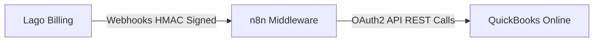
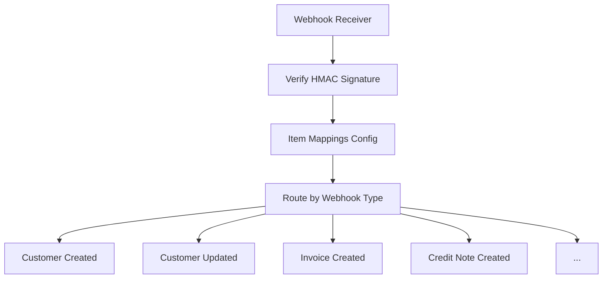

<Warning>
**Community maintained**: This integration is built and maintained by the Lago community. It is not an official Lago integration.
</Warning>

## Overview

Sync your Lago billing data to QuickBooks Online automatically using this community-maintained integration.
It uses n8n as middleware to transform Lago webhooks into QuickBooks API calls — so your accounting records stay in sync with your billing, without lifting a finger.

## How it works

The integration uses **[n8n](https://n8n.io/)** (a workflow automation platform) as middleware between Lago and [QuickBooks Online](https://quickbooks.intuit.com/).

<Info>
**Bring your own n8n** — This integration requires your own [n8n](https://n8n.io/) account (self-hosted or [Cloud](https://n8n.io/cloud/)).
n8n is a third-party service with its own pricing. You are responsible for managing and paying for your instance.
</Info>



### What gets synced

| Lago Event | QuickBooks Action | Description |
|------------|-------------------|-------------|
| `customer.created` | Create/Update Customer | Creates customer record with billing details |
| `customer.updated` | Update Customer | Updates existing customer information |
| `invoice.created` | Create Invoice | Creates invoice with line items and taxes |
| `invoice.one_off_created` | Create Invoice | Creates one-off invoice |
| `credit_note.created` | Create Credit Memo | Creates credit memo for refunds/adjustments |
| `invoice.payment_status_updated` | Create Payment (if succeeded) | Records successful payments |
| `invoice.voided` | Void Invoice | Voids invoice in QuickBooks |

### Key features

<CardGroup cols={3}>
  <Card title="Auto-create customers" icon="user-plus">
    Creates QuickBooks customers on-the-fly when processing invoices.
  </Card>
  <Card title="Exact tax override" icon="percent">
    Uses Lago's tax calculations instead of QuickBooks tax rates.
  </Card>
  <Card title="Duplicate prevention" icon="shield-check">
    Checks for existing records before creating new ones.
  </Card>
  <Card title="Item mapping" icon="right-left">
    Map Lago item codes to QuickBooks products/services.
  </Card>
  <Card title="Batch processing" icon="layer-group">
    Handle high-volume invoice creation with concurrency control.
  </Card>
  <Card title="Retry logic" icon="rotate">
    Automatic retries with exponential backoff for transient failures.
  </Card>
</CardGroup>

## Prerequisites

<AccordionGroup>
  <Accordion title="Required accounts" icon="key" defaultOpen>
    1. **Lago account** with API and webhook endpoints access
    2. **QuickBooks Online account** (Essentials, Plus, or Advanced)
    3. **n8n instance** — [n8n Cloud](https://n8n.io/cloud/) or [self-hosted](https://docs.n8n.io/hosting/)
  </Accordion>

  <Accordion title="QuickBooks developer setup" icon="screwdriver-wrench">
    1. Create a [QuickBooks Developer account](https://developer.intuit.com/)
    2. Create a new app in the Developer Portal
    3. Note your **Client ID** and **Client Secret**
    4. Set the OAuth2 redirect URI to `https://your-n8n-instance.com/rest/oauth2-credential/callback`
  </Accordion>

  <Accordion title="Technical requirements" icon="microchip">
    - n8n version **0.235.0** or higher
    - HTTPS endpoint for webhook receiver (required for production)
    - QuickBooks Online API access (included with QB Online subscriptions)
  </Accordion>
</AccordionGroup>

## Installation

<Steps>
  <Step title="Deploy the n8n workflow" icon="download">
    <Tabs>
      <Tab title="Import from file">
        1. Download `lago-quickbooks-main.json` from the [GitHub repository](https://github.com/getlago/lago-quickbooks-integration)
        2. In n8n, go to **Workflows** → **Add workflow**
        3. Click the **⋮** menu → **Import from file**
        4. Select the downloaded file and click **Import**
      </Tab>
      <Tab title="Import from URL (n8n Cloud)">
        1. In n8n, go to **Workflows** → **Add workflow**
        2. Click **Import from URL**
        3. Enter: `https://raw.githubusercontent.com/getlago/lago-quickbooks-integration/main/lago-quickbooks-main.json`
        4. Click **Import**
      </Tab>
    </Tabs>

    The workflow will be created with 47 nodes pre-configured.
  </Step>

  <Step title="Configure QuickBooks OAuth2 credentials" icon="lock">
    1. In n8n, click **+** → **Credentials** → **Add credential**
    2. Search for **QuickBooks OAuth2 API**
    3. Fill in the details:

    | Field | Value |
    |-------|-------|
    | **Credential name** | `QuickBooks OAuth2` |
    | **Client ID** | From QuickBooks Developer Portal → Your App → Keys & credentials |
    | **Client Secret** | From QuickBooks Developer Portal → Your App → Keys & credentials |
    | **Environment** | `sandbox` for testing, `production` for live data |
    | **Scope** | `com.intuit.quickbooks.accounting` |

    4. Click **Connect my account**, authorize in QuickBooks, then **Save**

    <Warning>
    The workflow expects the credential to be named **exactly** `QuickBooks OAuth2`. All 14 QuickBooks nodes reference it by name — use a different name and you'll need to update each one manually.
    </Warning>
  </Step>

  <Step title="Configure the workflow" icon="gear">
    The workflow has two configuration nodes.

    #### HMAC Signature node

    Open the **Verify HMAC Signature** node and edit the `CONFIG` object:

    ```javascript
    const CONFIG = {
      LAGO_WEBHOOK_SECRET: 'your_lago_webhook_secret_here',  // REQUIRED
      BYPASS_SIGNATURE: true,  // Set to false in production

      QB_ENVIRONMENT: 'sandbox',  // REQUIRED: 'sandbox' or 'production'
      QB_REALM_ID: 'your_quickbooks_company_id',  // REQUIRED
      QB_DEFAULT_ITEM_ID: '1',  // REQUIRED: Fallback QB Item ID
      QB_DISCOUNT_ACCOUNT_ID: '1'  // QB Account ID for discounts
    };
    ```

    | Field | Required | Description |
    |-------|----------|-------------|
    | `LAGO_WEBHOOK_SECRET` | Yes | From Lago → Settings → Webhooks → Secret |
    | `QB_ENVIRONMENT` | Yes | `sandbox` for testing, `production` for live |
    | `QB_REALM_ID` | Yes | Your QuickBooks company ID (see below) |
    | `QB_DEFAULT_ITEM_ID` | Yes | Default QuickBooks Item ID — see [Item mapping](#item-mapping) |
    | `QB_DISCOUNT_ACCOUNT_ID` | No | Account ID for discounts/credits |
    | `BYPASS_SIGNATURE` | No | Skip signature verification (dev only) |

    <AccordionGroup>
      <Accordion title="How to find your QB_REALM_ID">
        Log into QuickBooks Online and look at the URL:
        `https://app.qbo.intuit.com/app/homepage?realmId=123456789`

        The number after `realmId=` is your Realm ID. Alternatively, use the [API Explorer](https://developer.intuit.com/app/developer/qbo/docs/api/accounting/most-commonly-used/companyinfo) and look for `CompanyInfo.Id`.
      </Accordion>
      <Accordion title="How to find your QB_DEFAULT_ITEM_ID">
        Go to QuickBooks → **Settings** → **Products and Services**, click an item, and grab the ID from the URL:
        `https://qbo.intuit.com/app/item?id=1` — here, the Item ID is `1`.
      </Accordion>
    </AccordionGroup>

    #### Item Mappings Config node

    Open the **Item Mappings Config** node and edit the `MAPPINGS` object:

    ```javascript
    const MAPPINGS = {
      ITEM_MAPPINGS: {
        // 'startup_plan': '5',
        // 'premium_plan': '12',
      },
      ITEM_FALLBACK_ID: '1',  // REQUIRED: Same as QB_DEFAULT_ITEM_ID

      QB_TAX_CODE_ID: '',  // REQUIRED if you charge tax

      DISCOUNT_MAPPINGS: {},
      DISCOUNT_FALLBACK_ACCOUNT_ID: '1'
    };
    ```

    See [Item mapping](#item-mapping) and [Tax mapping](#tax-mapping) below for details.
  </Step>

  <Step title="Get your webhook URL" icon="link">
    1. In n8n, open the workflow and click the **Lago Webhook Receiver** node
    2. Copy the **Production URL** (e.g., `https://your-n8n.com/webhook/lago-webhook`)

    <Info>
    For production, you need an HTTPS webhook URL. n8n Cloud provides this automatically. For self-hosted n8n, ensure your instance is accessible via HTTPS.
    </Info>
  </Step>

  <Step title="Configure Lago webhooks" icon="webhook">
    1. In Lago, go to **Settings** → **Webhooks** → **Add a webhook endpoint**
    2. Paste the n8n webhook URL from the previous step
    3. Enable **HMAC signature** (strongly recommended)
    4. Copy the **Signature secret** and paste it into the `LAGO_WEBHOOK_SECRET` field in n8n
    5. Set `BYPASS_SIGNATURE: false` for production
  </Step>

  <Step title="Activate the workflow" icon="play">
    In n8n, toggle the workflow to **Active** (top right). Done — the workflow is now listening for Lago webhooks.
  </Step>
</Steps>

## Item mapping

Item mapping connects Lago billing items to QuickBooks products/services, so you can track revenue by product line.

When Lago sends an invoice, each fee includes an `item.code` (e.g., `"premium_plan"`). The workflow looks it up in `ITEM_MAPPINGS` and uses the matched QuickBooks Item ID — or falls back to `ITEM_FALLBACK_ID` if there's no match.

<Steps>
  <Step title="Find your QuickBooks Item IDs">
    Go to QuickBooks → **Settings** → **Products and Services**, click an item, and note the ID from the URL.
  </Step>
  <Step title="List your Lago item codes">
    In Lago, check **Billable metrics** and **Plans** for the `code` field on each item.
  </Step>
  <Step title="Create the mapping">
    Edit the **Item Mappings Config** node in n8n:

    ```javascript
    ITEM_MAPPINGS: {
      'startup_monthly': '10',    // QB: "Subscription Revenue"
      'premium_monthly': '10',    // QB: "Subscription Revenue"
      'api_calls': '20',          // QB: "Usage Revenue"
      'storage_gb': '20',         // QB: "Usage Revenue"
      'onboarding_fee': '30',     // QB: "Professional Services"
    },
    ITEM_FALLBACK_ID: '1',        // QB: "Services" (for unmapped items)
    ```
  </Step>
</Steps>

<Tip>
**Keep it simple** — You can map everything to a single QB item, group items by category, or go one-to-one. Pick the granularity that matches your accounting needs.
</Tip>

## Tax mapping

The integration uses QuickBooks' **tax override** feature — Lago's exact tax amounts show up in QuickBooks, regardless of QB's own tax rates. No recalculation, no rounding surprises.

Under the hood:
- Line items are marked `TAX` or `NON` based on Lago data
- The exact tax total from Lago is set via `TxnTaxDetail.TotalTax`
- The API uses `minorversion=70` to enable the override

<Steps>
  <Step title="Find your Tax Code ID">
    Use the [API Explorer](https://developer.intuit.com/app/developer/qbo/docs/api/accounting/all-entities/taxcode) to query:

    ```sql
    SELECT Id, Name FROM TaxCode WHERE Active = true
    ```

    Use the ID of the **taxable** code (e.g., `"TAX"` → `Id: "2"`), **not** `"NON"`.
  </Step>
  <Step title="Set the tax code">
    In the **Item Mappings Config** node:

    ```javascript
    QB_TAX_CODE_ID: '2',  // Your taxable code ID. Leave empty if no tax.
    ```
  </Step>
  <Step title="Test it">
    Create a test invoice with tax in Lago and verify the exact amounts match in QuickBooks.
  </Step>
</Steps>

<Accordion title="Troubleshooting tax issues" icon="bug">
  **Tax amount doesn't match** — Verify `QB_TAX_CODE_ID` is set and points to a taxable code (not "NON").

  **QuickBooks recalculates tax** — Ensure `minorversion=70` is in the API URL. The workflow includes this by default — check the node settings if you've modified things.
</Accordion>

## Understanding the flow

### Workflow architecture



### Event flows

<AccordionGroup>
  <Accordion title="Customer Created/Updated" icon="user">
    ```mermaid
    graph LR
      A[Transform Customer Data] --> B[Lookup Customer in QB] --> C[Prepare Upsert] --> D[Create/Update Customer]
    ```

    Deduplicates by `DisplayName` — updates if found, creates if not.
  </Accordion>

  <Accordion title="Invoice Created" icon="file-invoice" defaultOpen>
    ```mermaid
    graph LR
      A[Transform Invoice] --> B[Map Items] --> C[Lookup Customer]
      C -->|Not found| D[Create Customer] --> E[Finalize Invoice]
      C -->|Found| E
      E --> F[Lookup Invoice]
      F -->|Exists| G[Skip - duplicate]
      F -->|Not found| H[Create Invoice in QB]
    ```

    Auto-creates missing customers and prevents duplicates by checking `DocNumber`.
  </Accordion>

  <Accordion title="Credit Note Created" icon="file-circle-minus">
    Same flow as Invoice Created, but creates a **Credit Memo** in QB.
  </Accordion>

  <Accordion title="Payment Status Updated" icon="money-check-dollar">
    ```mermaid
    graph LR
      A[Extract Payment Info] --> B[Lookup Invoice in QB] --> C[Check Status]
      C -->|Succeeded| D[Create Payment]
      C -->|Other| E[Log status only]
    ```

    Only `succeeded` creates a QB Payment. Other statuses are logged and skipped.
  </Accordion>

  <Accordion title="Invoice Voided" icon="ban">
    ```mermaid
    graph LR
      A[Extract Invoice Info] --> B[Lookup Invoice in QB] --> C[Void Invoice in QB]
    ```
  </Accordion>
</AccordionGroup>

### Error handling

<CardGroup cols={2}>
  <Card title="Retries" icon="rotate-right">
    All QB API calls retry up to 5 times with exponential backoff.
  </Card>
  <Card title="Rate limiting" icon="gauge">
    1-second wait between API calls to stay within QB limits.
  </Card>
  <Card title="Duplicate prevention" icon="copy">
    Lookups before creation prevent duplicate records.
  </Card>
  <Card title="Missing customers" icon="user-plus">
    Auto-created when processing invoices or credit notes.
  </Card>
</CardGroup>

<Tip>
**Monitoring** — In n8n, go to **Executions** to view all workflow runs. Click any execution to see detailed logs per node.
</Tip>

## Scaling

| Limit | Value |
|-------|-------|
| Requests per minute | 500 |
| Concurrent requests | 10 |
| Per-second limit | 10 |

For n8n self-hosted, set the concurrency limit:

```bash
N8N_CONCURRENCY_PRODUCTION_LIMIT=10
```

n8n Cloud manages concurrency automatically. Incoming webhooks are queued in memory (FIFO) and processed within the concurrency limit.

| Scenario | Throughput | Time for 10k invoices |
|----------|------------|----------------------|
| Default (10 concurrent) | ~100/min | ~100 minutes |
| Optimized (parallel) | ~300/min | ~33 minutes |

For **10,000+ invoices per day**, consider separating workflows, using Redis-backed queues, or reaching out at support@getlago.com.

## Testing

Always test in QuickBooks Sandbox (`QB_ENVIRONMENT: 'sandbox'`) before going to production.

### Checklist

- [ ] **Customer sync**: Create/update customer in Lago → verify in QB
- [ ] **Invoice creation**: Create invoice in Lago → verify items and tax in QB
- [ ] **Credit note**: Create credit note → verify credit memo in QB
- [ ] **Payment**: Mark invoice as paid → verify payment in QB
- [ ] **Duplicate prevention**: Send same invoice twice → only one in QB
- [ ] **Tax calculation**: Tax amount in QB matches Lago exactly
- [ ] **Item mapping**: Correct QB items are used

### Troubleshooting

<AccordionGroup>
  <Accordion title="Webhook not received in n8n" icon="circle-exclamation">
    - Check the webhook URL in Lago settings
    - Verify the workflow is **Active** in n8n
    - Check n8n firewall/network settings
  </Accordion>
  <Accordion title="HMAC validation fails" icon="circle-exclamation">
    - Verify `LAGO_WEBHOOK_SECRET` matches Lago exactly
    - Check for extra spaces when copying the secret
  </Accordion>
  <Accordion title="QuickBooks authentication fails" icon="circle-exclamation">
    - Re-authorize the OAuth2 credential in n8n
    - Verify Client ID and Secret are correct
  </Accordion>
  <Accordion title="Tax amounts don't match" icon="circle-exclamation">
    - Check `QB_TAX_CODE_ID` is set and points to a taxable code (not "NON")
    - Verify `minorversion=70` is in the API URL (included by default)
  </Accordion>
</AccordionGroup>

## Production checklist

Before going live:

- [ ] `QB_ENVIRONMENT` set to `production`
- [ ] `BYPASS_SIGNATURE` set to `false`
- [ ] `QB_REALM_ID` matches your production company
- [ ] Item mappings configured and tested
- [ ] `QB_TAX_CODE_ID` configured (if using tax)
- [ ] QuickBooks OAuth2 credential authorized for production
- [ ] Lago webhook endpoint configured with HMAC enabled
- [ ] n8n workflow set to **Active**
- [ ] Error notifications configured (email/Slack)

## Support and resources

<CardGroup cols={2}>
  <Card title="GitHub repository" icon="github" href="https://github.com/getlago/lago-quickbooks-integration">
    Source code, issues, and contributions.
  </Card>
  <Card title="Lago community" icon="slack" href="https://getlago.com/slack">
    Join the Slack community or email success@getlago.com.
  </Card>
  <Card title="n8n documentation" icon="book" href="https://docs.n8n.io/">
    Official n8n docs for workflow and hosting setup.
  </Card>
  <Card title="QuickBooks API" icon="book" href="https://developer.intuit.com/app/developer/qbo/docs/api/accounting/most-commonly-used/invoice">
    QuickBooks Online API reference.
  </Card>
</CardGroup>
